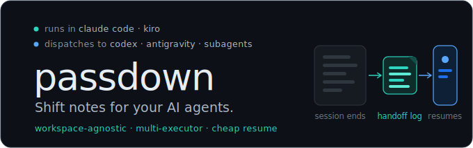
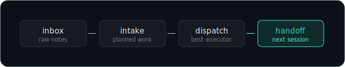

# passdown

<p align="center">
  
</p>

<p align="center">
  <a href="LICENSE"></a>
  
  
  <a href="https://github.com/vunm-io/passdown/actions/workflows/ci.yml"></a>
</p>

<p align="center"><strong>Shift notes for your AI agents.</strong></p>

> Like a passdown log between work shifts: one session (or agent) writes down
> the state, the next one picks it up — cheaply, from small files, with any tool.

**Status: v0 — dogfooding.** APIs, file layouts, and skill contents will change.

## Why

Working with AI coding agents across long-running projects has three recurring
problems:

1. **Sessions grow too long.** Context bloats, tokens get expensive, and there
   is no natural stopping point to resume from.
2. **One vendor is not enough.** Heavy work should go to whatever executor is
   cheapest and capable — another CLI agent, a subagent, a different model.
3. **Rules live in the wrong place.** Workspace-level conventions vanish when
   an agent opens a sub-repo, because project-level config follows the
   directory, not the user.

## Strengths

- **Workspace-agnostic** — skills install at user level and survive any `cwd` and sub-repo.
- **Multi-host** — the same skill core runs in Claude Code, Codex, and Kiro.
- **Multi-executor** — dispatch routes work to the cheapest compatible
  external CLI, native subagent, or main session declared in `AGENTS.md`.
- **Cheap resume** — the next session reads small handoff files, not a giant transcript.
- **Composes, not replaces** — fits alongside superpowers, OpenSpec, and
  host-specific executor adapters.
- **Native distribution** — ships as both Claude Code and Codex plugins, plus
  a direct installer for supported user-level skill directories.

## How it works

<p align="center">
  
</p>

passdown is three **workspace-agnostic skills** installed at user level, plus
conventions. Skills are the engine; each workspace's `AGENTS.md` is the config
(a `## passdown` section declares inbox/log locations, language, and available
executors). Nothing workspace-specific ever lives inside a skill — which is
also why the skills survive any `cwd` and any repo.

| Skill | What it does |
|---|---|
| `passdown-intake` | Turns raw notes from an inbox (dropped there by weak capture tools like chat apps) into properly planned work in the right repo |
| `passdown-dispatch` | Routes each task to the cheapest compatible external CLI, native subagent, or main session, then verifies the result |
| `passdown-handoff` | Ends every session with a small handoff log: summary, next steps, and the traps that live nowhere else |

**The dispatch gate.** `passdown-dispatch` is a *pre-execution gate*, not just
another skill: before a multi-task plan is executed — by the session itself or
by another plugin's executor, such as Superpowers `executing-plans` — every
pending task gets an explicit routing decision. The gate may route everything
to the main session; what it prevents is implementation starting with no
routing decision at all. Single, clearly scoped tasks requested directly by
the user are not hijacked, and native subagents still require explicit user
authorization. The consumer `AGENTS.md` template
([`templates/AGENTS.thin.md`](templates/AGENTS.thin.md)) states this invariant
so it holds in every workspace.

**Planning is pluggable.** Plans can be plain markdown files (see
[`templates/plan.md`](templates/plan.md)) with `[dispatch: external-ok]` /
`[dispatch: main]` tags, or [OpenSpec](https://github.com/Fission-AI/openspec)
changes using the bundled `passdown` schema. Neither OpenSpec nor
[superpowers](https://github.com/obra/superpowers) is required — see
[`docs/INTEGRATIONS.md`](docs/INTEGRATIONS.md) for the standalone and combined
workflows.

**Host vs. executor.** passdown can run as the orchestrator in Claude Code,
Codex, or Kiro. An executor is a separate target selected by
`passdown-dispatch`. Codex may be an external executor when passdown runs on a
different host; when Codex is already the host, `codex` is a self-target and is
skipped in favor of the current session or an explicitly authorized native
subagent.

## Support matrix

| Tool | Role | Status | Install / integration |
|---|---|---|---|
| **Claude Code** | Primary host — runs the three skills as a plugin | Supported | Plugin marketplace (`claude plugin marketplace add` / `install`) — see [Install](#install) |
| **Codex** | Host — runs the same three skills as a native plugin; may also be an external executor from another host | Supported | Codex marketplace (`codex plugin marketplace add` / `add`) or `./install.sh --host codex` |
| **Kiro** | Secondary host — user-level skill dir, same skills | Supported | `git clone` + `./install.sh --host kiro` |
| **Antigravity** | Dispatch executor — receives tasks from `passdown-dispatch` | Executor target, not a host | Not installed directly; configured as an executor in the consumer repo's `AGENTS.md`, invoked via the `agy` CLI |

passdown composes with, and does not replace — all of these are **optional**:

- [superpowers](https://github.com/obra/superpowers) — process discipline
  (TDD, debugging, planning etiquette); its plan executor must still pass
  through the passdown dispatch gate
- [OpenSpec](https://github.com/Fission-AI/openspec) — planning artifacts
  (living specs, change deltas, task lists whose state lives in files, not in
  sessions); without it, use the standalone markdown plan template
- [codex-plugin-cc](https://github.com/openai/codex-plugin-cc) — an optional
  Claude Code → Codex executor adapter

See [`docs/INTEGRATIONS.md`](docs/INTEGRATIONS.md) for how each combination is
expected to behave.

## Install

**As a Claude Code plugin (recommended):**

```bash
claude plugin marketplace add vunm-io/passdown
claude plugin install passdown@passdown
```

Or in the desktop app: Plugins → Add marketplace → "Add from a repository".
The plugin (and its skills) then shows up under Personal plugins, like any
marketplace plugin.

Once installed, the three skills load under the `passdown` plugin namespace.
They can trigger automatically on their descriptions — best-effort, not
guaranteed, which is why the consumer `AGENTS.md` invariant and explicit
invocation exist — and you can invoke them directly:

- `/passdown:passdown-intake`
- `/passdown:passdown-dispatch`
- `/passdown:passdown-handoff`

**As a Codex plugin (recommended):**

```bash
codex plugin marketplace add vunm-io/passdown
codex plugin add passdown@passdown
```

Restart Codex or open a new thread after installation. The skills appear under
the `passdown` plugin namespace and can trigger from their descriptions or be
selected explicitly from the skill/plugin picker.

**Direct user-level install:**

```bash
# HTTPS (recommended for public users):
git clone https://github.com/vunm-io/passdown.git && cd passdown
# or SSH, if you have a key set up (handy for maintainers):
# git clone git@github.com:vunm-io/passdown.git && cd passdown
./install.sh --host claude
./install.sh --host codex
./install.sh --host kiro
```

If you do not use OpenSpec, add `--skills-only` to skip the optional OpenSpec
schema files:

```bash
./install.sh --host claude --skills-only
```

Pick **one channel per host**: plugin or direct install, never both. Duplicate
channels expose namespaced and unnamespaced copies of the same skill and can
leave different versions active. Remove the direct `passdown-*` directories
from that host's user skill directory before switching to its plugin channel.

Running `./install.sh` without `--host` preserves the legacy behavior: Claude
Code, Kiro when `~/.kiro` already exists, and the user-level OpenSpec schema.
For new installations, prefer an explicit host.

Antigravity remains executor-only. Configure it, or an external Codex adapter
used from another host, under `executors` in the consumer workspace's
`AGENTS.md`.

Then add a `## passdown` section to your workspace's `AGENTS.md` (see
`templates/AGENTS.thin.md` for a starting point).

## Layout

```
plugins/passdown/skills/   # the three skills (English, workspace-agnostic)
plugins/passdown/.codex-plugin/ # native Codex plugin manifest
.agents/plugins/marketplace.json # native Codex marketplace
schemas/passdown/          # OpenSpec workflow schema customizations (optional)
templates/AGENTS.thin.md   # thin AGENTS.md template for sub-repos
templates/plan.md          # standalone markdown plan template (no OpenSpec)
assets/                    # README hero + flow SVGs
install.sh                 # host-selectable user installer + repo-local schema copy
scripts/check-version.sh   # VERSION/manifest/tag agreement
scripts/validate-plugin.sh   # strict manifest validation (bash)
scripts/validate-plugin.ps1  # same, for Windows PowerShell (Git Bash/WSL path issues)
examples/basic-workspace/  # a worked example: inbox note, OpenSpec change, session log
docs/SMOKE_TEST.md         # manual verification checklist for install + skills
docs/INTEGRATIONS.md       # standalone, OpenSpec, and Superpowers workflows
docs/EXECUTOR_SETUP.md     # pre-flight checklist before adding a dispatch executor
docs/GITHUB_SETTINGS.md    # required merge methods and main ruleset
```

See [`examples/basic-workspace/`](examples/basic-workspace/) for what an
inbox note, a completed `passdown`-schema OpenSpec change, and a session log
actually look like end to end. See [`docs/SMOKE_TEST.md`](docs/SMOKE_TEST.md)
before shipping any change to `install.sh`, the plugin manifests, or the
schema.

## Distribution status

- **GitHub-hosted Claude Code marketplace** — supported.
- **GitHub-hosted Codex marketplace** — supported.
- **Community directories** — optional after public smoke testing.

See [`docs/RELEASE.md`](docs/RELEASE.md) for the recurring release checklist.

## License

MIT
