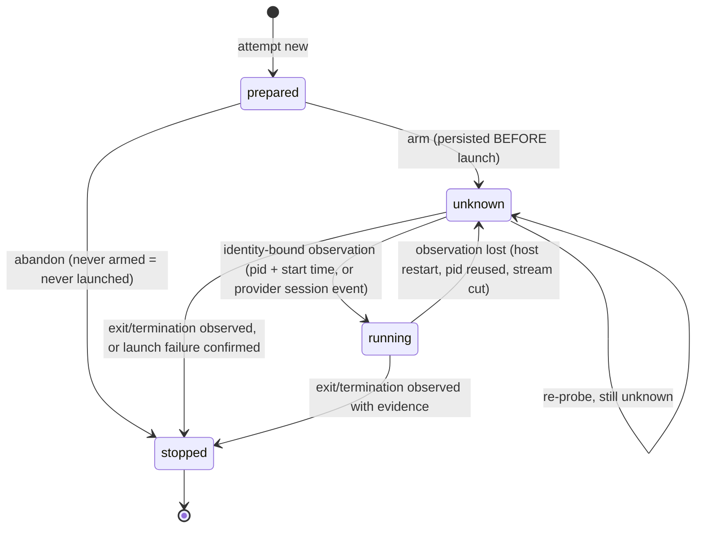

# PDN-0004 — v0.5 acceptance and interrupted-dispatch recovery

| | |
|---|---|
| **Status** | Proposed — design only, no implementation yet |
| **Date** | 2026-09-21 |
| **Issue** | [#12](https://github.com/vunm-io/passdown/issues/12) |
| **Architecture** | [RFC #10](https://github.com/vunm-io/passdown/issues/10): Round 3 synthesis and final Claude/Codex dispositions |
| **Baseline** | [#13](https://github.com/vunm-io/passdown/pull/13), merged as `1a9ee38` (PDN-0003, delegated completion authority) |
| **Author** | Claude (primary implementer) |
| **Reviewer** | ChatGPT |

This document turns the accepted RFC #10 architecture into a bounded
technical design and an implementation plan. It does not reopen the RFC.
Where this design makes a choice the RFC left open, the choice is marked
**Decision** and the alternatives are listed in §25.

Key words MUST, MUST NOT, SHOULD and MAY are normative.

---

## 1. Context

Passdown v0.4.0 plus the merged PDN-0003 fix already guarantees one
thing: **a delegated worker never accepts its own work.** The host assigns an
exact task reference, forbids plan edits in the prompt, diffs the plan against
a pre-dispatch baseline, runs its own verification, and writes a
`Dispatched: … — accepted; verified: …` line before ticking the checkbox.
Handoff and pickup share one accepted-verdict rule.

What v0.4.x cannot do is survive an interruption. Everything between
"host decides to dispatch" and "host writes the `Dispatched:` line" lives in
the host session only:

- If the host dies after launching a worker, nothing on disk says a worker
  exists, where it runs, or what it was told. The next session cannot tell
  "never launched" from "still writing".
- The worker's report is free text. Nothing binds it to the attempt that
  produced it, the task revision it answered, or the artifact it describes.
- The verdict is bound to nothing but a prose check name. A task edited after
  verification still looks accepted.
- The dispatch skill treats silence as failure ("a stale running status is a
  failure — cancel … and escalate"). That conflates *unknown* with *failed*
  and invites a second writer on top of a live one.
- Mechanical steps (unique IDs, digests, transition checks) are left to a
  model following prose. The PDN-0003 bug is the precedent: the prose
  contradicted itself and 47 text-presence checks still passed.

Current source this design starts from (`main` at `1a9ee38`):

| File | Relevant behavior today |
|---|---|
| `plugins/passdown/skills/passdown-dispatch/SKILL.md` | Execution gate; "route to the cheapest executor"; completion authority; 9-step dispatch contract; baseline + restore; `Dispatched:` verdict lines; stale-job = failure; executor invocation table inline. |
| `plugins/passdown/skills/passdown-pickup/SKILL.md` | Read-only briefing; flags `[x]` without an accepted verdict as *inconsistent* / *unconfirmed*. |
| `plugins/passdown/skills/passdown-handoff/SKILL.md` | Syncs checkboxes to accepted work only; unverified delegated work named in Caveats. |
| `schemas/passdown/schema.yaml` | `apply.instruction` tells an assigned worker not to edit `tasks.md`. |
| `templates/plan.md` | `[dispatch: …]` tags, `Dispatched:` example line. |
| `tests/*.sh` | Bash 3.2, shellcheck-clean; text-contract checks plus one behavioral OpenSpec check. |

## 2. Goals

1. A durable **attempt receipt** exists before any delegated worker can
   start, outside any disposable worktree.
2. Two host-owned state dimensions — **execution observation** and
   **acceptance verdict** — with a written transition table that a
   deterministic helper enforces.
3. A small versioned **worker result** JSON contract that the host validates,
   whatever the provider does natively.
4. Acceptance bound to the exact **task digest**, the exact inspected
   **artifact digest** and host **verification evidence**, persisted
   **before** the plan checkbox is projected.
5. `passdown-pickup` surfaces every unresolved attempt with a recovery class
   and a safe proposed action. Nothing uncertain is retried automatically.
6. Serial scheduling by default; worktree-per-attempt for the simple class;
   concurrency only with a declared profile.
7. Routing ladder with a recorded reason. Depth-one cross-provider delegation.
8. Volatile provider mechanics move into versioned **executor reference
   cards** whose capabilities are *measured*, not copied from docs.
9. Release evidence from **behavior**: deterministic fixtures plus induced
   interruptions. Gate: zero false acceptance, zero silent duplicate
   overlapping writers.

## 3. Non-goals

Not in v0.5, restated from #12 so a reviewer can check the design against it:

- a Passdown daemon, runtime, scheduler or process supervisor;
- a generic ACP client, an MCP job server, A2A;
- a Beads (or any other) task backend, or a second task database;
- an editable Task Capsule;
- a universal capability taxonomy;
- a mandatory cross-vendor reviewer;
- automatic failover or automatic retry of uncertain writers;
- dashboards or telemetry.

Also out of scope: tamper-*proof* receipts (§24), controlling
provider-native descendants that the transport cannot observe (§4 I-12), and
a live question channel (§14).

## 4. Design invariants

Each invariant names the mechanism that enforces it. "Helper" means the
deterministic helper in §10; "fixture" means a scenario in §20.

| # | Invariant | Enforced by |
|---|---|---|
| I-1 | A delegated worker never accepts its own work; its result is evidence. | PDN-0003 prose (kept), helper `verdict` is host-only, fixtures F1/F2 |
| I-2 | The planner owns task intent; receipts reference it and never copy it as editable truth. | Receipt stores task *ref + digest* only (§6) |
| I-3 | An attempt has a durable identity before launch. | `attempt new` must precede `attempt arm`; `arm` must precede launch (§11) |
| I-4 | Provider session ID ≠ attempt ID. Retry and continuation create a new attempt, even inside one provider session. | Receipt `handle` vs `id`; `new --continues` (§14) |
| I-5 | Execution observation ∈ {prepared, running, stopped, unknown}; verdict ∈ {pending, accepted, rejected}; worker disposition lives only in the validated result. | Receipt schema + helper transition table (§8) |
| I-6 | `unknown` is neither success nor failure. Silence is not failure. | Helper has no `unknown → failed` path; dispatch prose change (§21) |
| I-7 | A cancellation request does not prove termination. | `cancel` records a request; only `observe stopped` with evidence ends execution (§15) |
| I-8 | A writing attempt may be accepted only when execution is **stopped + reconciled**. `accepted + {prepared, running, unknown}` is invalid. | Helper `verdict accept` preconditions (§12) |
| I-9 | `rejected + {running, unknown}` is valid and keeps ownership risk. | Helper allows it; serial guard still counts it (§16) |
| I-10 | Acceptance is bound to task digest, artifact digest and verification evidence. | Helper recomputes both digests at `verdict accept` (§12) |
| I-11 | The verdict is persisted before the plan checkbox is projected. | Ordering in §12; helper `projected` refuses without a persisted accepted verdict |
| I-12 | An unresolved writer retains ownership risk; no overlapping writer starts while one is unresolved. Passdown does not claim to see provider-native descendants it cannot observe. | Helper serial guard on `new` (§16); `stop_evidence` strength recorded per card (§18) |
| I-13 | Uncertain writes are never retried automatically. | Pickup is read-only; reconcile needs a human-visible host action (§13) |
| I-14 | Environment/permission denial maps to `blocked` and never widens privileges automatically. | Result schema `blocker`; dispatch prose (§11) |
| I-15 | Receipts and results live outside disposable worktrees. | Default store in the Git common dir; helper refuses a store inside the attempt's worktree (§5) |
| I-16 | Acceptance inspects the actual submission, including uncommitted and untracked output. | Helper `inspect` artifact definition (§12.2) |
| I-17 | A malformed result gets at most one no-new-writes re-emit, with unchanged artifact digest. | Helper refuses a second re-emit in a chain; `inspect` digest comparison (§12.4) |
| I-18 | Passdown-controlled cross-provider depth is 1. | Prompt clause + helper refuses `new --tier external` when `PASSDOWN_ATTEMPT` is set (§17) |
| I-19 | Behavior, not prompt-text presence, decides whether the protocol works. | Fixture harness is the release gate (§20) |

## 5. File/artifact layout

### 5.1 Attempt store

**Decision:** the default attempt store is

```text
$(git -C <planner-repo> rev-parse --git-common-dir)/passdown/attempts/
```

— that is, `.git/passdown/attempts/` of the repository that holds the plan.
Override with a new config key `attempt_dir` (§21).

Why the Git common dir:

- It is shared by the main checkout and **every** linked worktree of the
  repository, and removing any worktree does not touch it. A host that itself
  runs in a linked worktree (common for agents) therefore still writes
  outside anything disposable. A store under the checkout's working tree
  (`<repo>/.passdown/`) fails exactly that case.
- It is never committed, so receipts never create commit noise or merge
  conflicts, and `git clean -fdx` cannot delete them.
- It needs no `.gitignore` edit in consumer repositories.

Costs: it is hidden from people browsing the tree (the helper's `list` and
pickup make it visible), and it does not travel between machines. The second
cost is acceptable: an in-flight attempt is a fact about one machine, and a
different machine could not reconcile a process it cannot see. Handoff logs,
which do travel, name unresolved attempt IDs (§13.4).

The helper MUST refuse a store path that is inside the attempt's own
execution worktree, and SHOULD warn when the store is inside any linked
worktree's working tree.

### 5.2 Per-attempt directory

```text
<attempt_dir>/
  <attempt-id>/
    receipt.json        # host-owned; mutated only through the helper
    baseline.json       # immutable after `new`: HEAD + dirty-path snapshot
    task.md             # immutable copy of the normalized task block at `new`
    prompt.md           # immutable: exact prompt sent (for re-emit/continuation)
    transport.log       # host-captured stdout/stream of the worker (append-only)
    result.raw          # host-extracted final payload, as received
    result.json         # validated result (written only if validation passes)
    inspect.json        # changed-path set + per-path content hashes, per inspection
    checks/             # host verification outputs (one file per check)
```

The worker is never told this path (§24). The host captures the worker's
output itself (shell redirect or provider stream), so the worker has no reason
to write into the store.

### 5.3 Attempt ID

**Decision:** `pd-<UTC yyyymmddThhmmssZ>-<8 lowercase hex>`, e.g.
`pd-20260921T101530Z-3f9a1c2e`. Generated by the helper from the clock plus
8 random hex digits from `/dev/urandom`; `new` fails if the directory already
exists (mkdir is the uniqueness check). The ID sorts by creation time and
carries no task semantics — the task lives in the receipt. The RFC's
illustrative `pdn-0003-2.1-a2` form was rejected because allocating `a<N>`
requires reading and counting existing attempts, which races.

### 5.4 Plan projection

The canonical plan keeps the v0.4.x `Dispatched:` line and gains an attempt
reference at the end:

```markdown
- [x] 2.1 Add receipt schema [dispatch: external-ok]
  - Dispatched: kiro-cli (2026-09-22) — accepted; verified: tests/receipt.sh; attempt: pd-20260922T081200Z-3f9a1c2e
```

The attempt reference sits after the check so a v0.4.x reader, whose rule is
"`accepted` and a host check after `verified:`", still parses the line.

### 5.5 Repository layout added by v0.5

```text
schemas/protocol/receipt.v1.schema.json     # canonical contract
schemas/protocol/result.v1.schema.json      # canonical contract
scripts/passdown-attempt                    # canonical helper source
scripts/sync-bundled.sh                     # copies helper + schemas into skills
plugins/passdown/skills/passdown-dispatch/
  scripts/passdown-attempt                  # bundled copy (CI: byte-identical)
  schemas/result.v1.schema.json             # bundled copy, handed to providers that enforce schemas
  references/executors/{claude,codex,kiro-cli}.md
plugins/passdown/skills/passdown-pickup/scripts/passdown-attempt    # bundled copy
plugins/passdown/skills/passdown-handoff/scripts/passdown-attempt   # bundled copy
tests/attempt.sh                            # helper unit + transition tests
tests/fixtures/attempt/{receipts,results}/  # valid/invalid corpus
tests/harness/                              # reference host + fake executor (test-only, never shipped)
tests/interrupt.sh                          # interruption matrix (§20)
```

Bundled copies exist because each install channel (Claude plugin, Codex
plugin, Kiro direct copy) ships skill directories wholesale, and a skill can
reliably address files inside its own directory. See open question Q2.

## 6. Attempt receipt schema

`receipt.json`, JSON, UTF-8, `schema: "passdown.receipt/v1"`. Fields marked
★ are immutable after `new`.

```jsonc
{
  "schema": "passdown.receipt/v1",                 // ★
  "id": "pd-20260921T101530Z-3f9a1c2e",            // ★
  "rev": 7,                                        // incremented by every helper write
  "kind": "write",                                 // ★ write | read | reemit | salvage
  "continues": null,                               // ★ predecessor attempt ID or null
  "created_at": "2026-09-21T10:15:30Z",            // ★

  "task": {                                        // ★ whole object
    "ref": "openspec/changes/pdn-0004-x/tasks.md#2.1",
    "planner_repo": "/abs/path/to/repo",
    "digest": "sha256:…",                          // normalized task block, §12.1
    "inputs": [ { "path": "openspec/changes/pdn-0004-x/specs/a/spec.md", "digest": "sha256:…" } ],
    "paths": ["scripts/", "tests/attempt.sh"]      // declared scope from the task's Paths field
  },

  "host": {                                        // ★
    "agent": "claude",                             // host name, as in handoff frontmatter
    "session": "…",                                // host session ID if the host exposes one, else null
    "passdown_version": "0.5.0"
  },

  "route": {                                       // ★
    "tier": "external",                            // current | native | external
    "reason_code": "required-environment",         // §17
    "reason": "needs Gradle daemon only configured in kiro profile"
  },

  "executor": {                                    // ★ except `version`/`engine` may be filled at first observation
    "name": "kiro-cli",
    "card": "kiro-cli@1",                          // executor reference card + card version
    "version": "2.22.1",
    "engine": "…",                                 // model/engine if observable, else null
    "invocation_digest": "sha256:…"                // digest of the exact argv template used
  },

  "place": {                                       // ★
    "repo": "/abs/path/to/target-repo",
    "base_ref": "main",
    "base_commit": "1a9ee38…",
    "isolation": "worktree",                       // current-checkout | worktree | read-only
    "profile": null,                               // concurrency profile name, §16
    "location": "/abs/path/to/worktree"            // where the worker runs
  },

  "handle": {                                      // set by the host after launch
    "pid": 48211,
    "pid_started": "Mon Sep 21 10:15:31 2026",     // `ps -o lstart=`, binds pid to this process
    "pgid": 48211,
    "provider_session": "…",                       // provider's session ID if it prints one
    "runner": null                                 // e.g. an acpx session later; null in v0.5
  },

  "execution": {
    "observation": "stopped",                      // prepared | running | stopped | unknown
    "observed_at": "2026-09-21T10:31:02Z",
    "stop_evidence": "exit+pgroup-empty",          // §8.3; null unless stopped
    "exit": { "code": 0, "signal": null },
    "cancel_requested_at": null,
    "cancel_method": null,
    "reconciled_at": "2026-09-21T10:31:40Z"        // set by `inspect` after stopped
  },

  "result": {
    "ref": "result.json",                          // null until a valid result is stored
    "disposition": "submitted",                    // copied from result.json for listing only
    "status": "valid",                             // none | valid | invalid
    "diagnostics": [],                             // validation errors when invalid
    "source": null                                 // "reemit:<id>" when a re-emit supplied it
  },

  "artifact": {
    "digest": "sha256:…",                          // from the latest `inspect`
    "changed": 3,
    "out_of_scope": [],                            // paths outside task.paths
    "plan_touched": false                          // worker edited the plan file
  },

  "verdict": {
    "acceptance": "accepted",                      // pending | accepted | rejected
    "reason_code": null,                           // required when rejected, §8.4
    "reason": null,
    "task_digest": "sha256:…",                     // recomputed at verdict time
    "artifact_digest": "sha256:…",                 // recomputed at verdict time
    "checks": [ { "name": "tests/attempt.sh", "exit": 0, "output": "checks/1.txt" } ],
    "integration": { "into": "/abs/host/checkout", "head": "…" },  // when the done criteria need the integrated tree
    "at": "2026-09-21T10:33:10Z",
    "projected_at": "2026-09-21T10:33:25Z"         // plan checkbox + Dispatched line written
  },

  "transitions": [                                 // append-only audit, written by the helper
    { "rev": 2, "field": "execution.observation", "from": "prepared", "to": "unknown", "at": "…", "note": "arm" }
  ]
}
```

Rules:

- The receipt is **secret-free**: no environment dump, no credentials, no
  tokens. `prompt.md` and `transport.log` may contain whatever the task text
  and tools printed; they stay in the local store and are never copied into
  the plan, the handoff or a PR (§24).
- No task intent is duplicated in an editable form. `task.md` is an immutable
  snapshot used only for staleness diagnostics and rehydration.
- `rev` provides optimistic concurrency: every mutating helper call takes
  `--rev N` and fails if the file's `rev` differs. Two hosts cannot silently
  overwrite each other.
- Writes are atomic: write `receipt.json.tmp.<pid>`, `fsync` where available,
  `mv` over the old file.

## 7. Worker result schema

`schema: "passdown.result/v1"`. The worker returns this as its **final
payload**; the executor card says how the host extracts it from the provider's
envelope (§18). The host never scans a transcript for whichever JSON fragment
happens to validate.

```jsonc
{
  "schema": "passdown.result/v1",
  "attempt": "pd-20260921T101530Z-3f9a1c2e",       // MUST equal the receipt ID
  "disposition": "submitted",                      // submitted | needs_input | blocked | failed
  "summary": "Added receipt schema and tests.",    // ≤ 2000 chars
  "changed_paths": [                               // claims; the host inspects independently
    { "path": "schemas/protocol/receipt.v1.schema.json", "change": "added" },
    { "path": "tests/attempt.sh", "change": "modified" }
  ],
  "evidence": [                                    // what the worker ran and saw
    { "kind": "command", "command": "tests/attempt.sh", "exit_code": 0, "observed": "1..42" }
  ],
  "assumptions": ["receipt timestamps are UTC"],
  "caveats": [],
  "question": null,                                // REQUIRED object iff needs_input
  "blocker": null                                  // REQUIRED object iff blocked
}
```

Conditional members:

```jsonc
"question": { "text": "Should re-emit reuse the provider session?",
              "options": ["reuse", "fresh"],        // optional
              "context_paths": ["docs/design/…"] }  // optional
"blocker":  { "kind": "permission",                 // permission | sandbox | network | tool-missing | other
              "message": "<verbatim error>" }
```

Validation rules (all deterministic, all in the helper):

| Rule | Failure diagnostic |
|---|---|
| Parses as a single JSON object, ≤ 256 KiB | `parse` |
| `schema` is exactly `passdown.result/v1` | `schema-version` |
| `attempt` equals the receipt ID | `attempt-mismatch` |
| `disposition` in the enum | `disposition` |
| `question` present and non-empty iff `needs_input` | `question` |
| `blocker` present iff `blocked` | `blocker` |
| Every `changed_paths[].path` is relative, normalized, no `..`, no leading `/` | `path` |
| No members beyond the schema, except under `x_`-prefixed keys | `unknown-member` |
| String lengths within limits | `length` |

A result that fails any rule is stored as `result.raw` with
`result.status = invalid` and its diagnostics. It never becomes
`result.json`. What happens next is §12.4.

`failed` carries no extra member; its `summary` and `evidence` explain it.

## 8. State semantics and valid/invalid combinations

### 8.1 Execution observation



| From \ To | prepared | unknown | running | stopped |
|---|---|---|---|---|
| **prepared** | — | ✅ `arm` | ❌ must arm first | ✅ `abandon` (evidence `not-launched`) |
| **unknown** | ❌ | ✅ re-probe | ✅ identity-bound evidence required | ✅ stop evidence required |
| **running** | ❌ | ✅ observation lost | — | ✅ stop evidence required |
| **stopped** | ❌ | ❌ | ❌ | — (terminal) |

The launch-window rule is the core of recovery: `prepared` is persisted, then
`unknown` is persisted **before** the launch command is issued, then `running`
only once the host holds an observation bound to that process. Consequences:

- **`prepared` proves the worker was never launched**, as long as the host
  followed the protocol. Pickup may therefore offer to abandon it safely.
- A crash between launch and saving the handle leaves `unknown`. That window
  is deliberately uncertain, never assumed empty.
- `stopped` is terminal. A worker that must continue gets a new attempt.

### 8.2 Acceptance verdict

| From \ To | accepted | rejected |
|---|---|---|
| **pending** | ✅ only if §12 preconditions hold | ✅ any time |
| **accepted** | — | ❌ (terminal; see §8.5) |
| **rejected** | ❌ | — (terminal) |

### 8.3 Stop evidence

`stop_evidence` is one of, from strongest to weakest:

| Value | Meaning |
|---|---|
| `exit+pgroup-empty` | The launched process exited and no process remains in its process group. |
| `provider-final` | The provider emitted its documented terminal event and the process exited. |
| `exit` | The launched process exited; descendants were not checked or cannot be. |
| `not-launched` | Only from `prepared` (never armed), or a launch failure the host saw directly (e.g. `ENOENT`). |
| `owner-attested` | A human confirmed no writer remains (e.g. after reboot). Recorded with who/when. |

The executor card declares the minimum evidence that counts as *stopped* for
that executor (§18). If a card says the provider can leave detached writers
(background tasks, native subagents outliving the parent) and the host only
has `exit`, the helper records `stopped` but `verdict accept` additionally
requires the double-inspection check in §12.3.

### 8.4 Rejection reason codes

`invalid_result`, `verification_failed`, `scope_violation`, `plan_tampered`,
`needs_input`, `blocked`, `worker_failed`, `stale`, `abandoned`, `cancelled`,
`superseded`, `integration_failed`, `reemit_wrote`.

`rejected` is a verdict on **one attempt's submission**, never on the task.
`needs_input` and `blocked` use `rejected` because the submission is not
acceptable as completion; the task stays open and a continuation follows.

### 8.5 Combination table

Worker disposition is shown for completeness; it is not host state.

| Observation | Verdict | Valid? | Meaning / what pickup does |
|---|---|---|---|
| prepared | pending | ✅ | Created, never armed → never launched. Offer `abandon`. |
| prepared | accepted | ❌ | Invalid. Nothing ran. |
| prepared | rejected | ✅ | Abandoned before launch (after `abandon` it becomes stopped/rejected). |
| unknown | pending | ✅ | Launch or observation uncertain. **Ownership risk.** Probe; never retry. |
| unknown | accepted | ❌ | Invalid (I-8). |
| unknown | rejected | ✅ | Rejected but writer may live. **Ownership risk.** |
| running | pending | ✅ | Live writer. Wait, or request cancel. |
| running | accepted | ❌ | Invalid (I-8). |
| running | rejected | ✅ | Rejected while live. **Ownership risk** until stopped. |
| stopped | pending, no valid result | ✅ | Crash after exit, or malformed/missing result. §12.4. |
| stopped | pending, valid result | ✅ | Ready for acceptance lifecycle (§12). |
| stopped | accepted, not projected | ✅ | Crash between verdict and checkbox. Repair projection (§13). |
| stopped | accepted, projected | ✅ | Resolved. |
| stopped | rejected | ✅ | Resolved. |
| any | accepted without `reconciled_at` | ❌ | Invalid (I-8). |
| any | accepted without artifact digest or ≥1 check | ❌ | Invalid (I-10). |
| any | accepted with `task_digest ≠ task.digest` | ❌ | Invalid: accepted against another revision. |
| — | result `needs_input` without `question` | ❌ | Invalid result (§7). |
| — | result `attempt ≠ id` | ❌ | Invalid result. |

**Resolved** = `observation = stopped` **and** `verdict ≠ pending` **and**
(`verdict = accepted` ⇒ `projected_at` set). Everything else is unresolved.
**Ownership risk** = `observation ∈ {running, unknown}`, whatever the verdict.

An accepted verdict is never flipped. If later evidence shows it was wrong,
the planner unticks the task, the old receipt remains as history, and a new
attempt does the work again. (A `revoked` state was considered and left out;
§25.)

## 9. Ownership table for every mutable field

Receipt, result and plan fields. "Helper" means written *through* the helper
by the named actor; nobody edits `receipt.json` by hand.

| Field | Written by | When | Worker may write? |
|---|---|---|---|
| receipt ★ fields (`id`, `kind`, `continues`, `task`, `host`, `route`, `place`, `created_at`) | Host via helper `new` | Once | ❌ |
| `executor.version`, `executor.engine` | Host via helper | `new`, or first observation if only then known | ❌ |
| `handle.*` | Host via helper `observe` | After launch | ❌ |
| `execution.observation`, `observed_at`, `stop_evidence`, `exit` | Host via helper `observe` / `abandon` | Transitions §8.1 | ❌ |
| `execution.cancel_requested_at`, `cancel_method` | Host via helper `cancel` | On cancel request | ❌ |
| `execution.reconciled_at`, `artifact.*` | Helper `inspect` (host-invoked) | After `stopped` | ❌ |
| `result.*` and `result.json` | Helper `result` (host-invoked) from host-captured payload | After extraction | ❌ (worker authors the *payload*, not the file) |
| `verdict.*` except `projected_at` | Host via helper `verdict` | §12 | ❌ |
| `verdict.projected_at` | Host via helper `projected` | After the plan edit | ❌ |
| `rev`, `transitions[]` | Helper only | Every write | ❌ |
| Result payload (disposition, claims, evidence, question, blocker) | Worker | Final output | ✅ — this is the worker's only authored artifact besides the task's files |
| Task text, paths, done criteria, verification | Planner (host on planner's behalf) | Plan edits | ❌ |
| Plan checkbox | Host | Only after persisted accepted verdict (I-11) | ❌ |
| `Dispatched:` line | Host | After verdict | ❌ |
| Files inside `task.paths` | Worker | During execution | ✅ |
| Handoff log `open_attempts` | Handoff (host) | End of session | ❌ |

This is a **logical** authority boundary. Files do not enforce access control;
a worker with broad filesystem access can write anywhere. The design detects
violations it can see (plan diff, out-of-scope paths, result attempt
mismatch, receipt `rev`/transition inconsistencies) and does not claim to
prevent them (§24).

## 10. Deterministic helper

### 10.1 Scope

`passdown-attempt` is a **stateless** CLI. Each invocation reads files,
checks rules, writes files atomically and exits. It:

- generates attempt IDs;
- creates receipts and baseline/task snapshots;
- applies validated field transitions;
- computes task and artifact digests;
- validates receipts and results against the v1 contracts;
- detects stale results and invalid combinations;
- lists attempts with a recovery class;
- enforces the serial-writer guard and the depth guard.

It MUST NOT launch, signal, wait for or monitor agents; open network
connections; schedule anything; run in the background; or edit plan files.
The one process-related thing it does is *read-only*: `probe` asks the OS
whether a recorded `pid` still exists with the recorded start time. It never
sends a signal. (Cancellation signals are sent by the host, per the card.)

### 10.2 Implementation constraints

**Decision:** Bash 3.2-compatible script + `jq` ≥ 1.6 + `git`, shellcheck-clean,
matching the repo's existing tooling and CI.

- macOS ships `/usr/bin/jq` (measured: `jq-1.7.1-apple` on macOS 26.6);
  Linux CI images have it; Windows Git Bash does not ship it (open question
  Q1).
- SHA-256 via `sha256sum`, falling back to `shasum -a 256`.
- JSON Schema files under `schemas/protocol/` are the **published contract**.
  The helper implements the same rules in jq so it has no Node/Python runtime
  dependency. CI runs a conformance test: every fixture in
  `tests/fixtures/attempt/` must get the same valid/invalid verdict from the
  helper and from a pinned JSON Schema validator (dev-only, e.g. `ajv-cli` via
  `npx`). Drift between prose contract and code is then a red build.

### 10.3 Interface

Global options: `--store <dir>` (else resolved from config / Git common dir),
`--json` (machine output). Mutating commands require `--rev <n>`.
Exit codes: `0` ok · `2` usage · `3` invalid transition / precondition failed ·
`4` validation failed · `5` rev conflict · `6` guard refused (serial/depth).

| Command | Effect |
|---|---|
| `new --task-ref <plan#id> --kind write\|read\|reemit\|salvage --tier current\|native\|external --reason-code <c> --reason <txt> --executor <name> --card <name@v> --place-repo <p> --isolation <i> [--location <p>] [--profile <p>] [--continues <id>] [--input <path>…]` | Allocate ID, snapshot task block + inputs + baseline, write receipt with `prepared`/`pending`. Runs serial and depth guards. Prints ID. |
| `arm <id> --prompt <file>` | Store the exact prompt as `prompt.md`, then `prepared → unknown`, note `arm`. The host issues the launch command only after this returns 0, so the prompt is always on disk before a worker can exist. |
| `observe <id> running --pid <n> [--pid-started <s>] [--pgid <n>] [--provider-session <s>]` | `unknown → running`. Requires identity: `pid` + start time, or a provider session ID. |
| `observe <id> stopped --evidence <e> [--exit <code>] [--signal <s>] [--attested-by <who>]` | `unknown\|running → stopped`. |
| `observe <id> unknown --note <txt>` | `running → unknown` (observation lost). |
| `abandon <id>` | `prepared → stopped` with `not-launched`, verdict `rejected/abandoned`. Refused in any other state. |
| `probe <id>` | Read-only. Reports whether `pid` exists with the same start time and whether its process group is empty. Writes nothing. |
| `cancel <id> --method <m>` | Records `cancel_requested_at` and method. Does not change observation. |
| `result <id> --payload <file>` | Validate payload (§7). Valid → `result.json`, `result.status=valid`. Invalid → `result.raw` + diagnostics. A second valid result for the same attempt is refused. |
| `inspect <id>` | Requires `stopped`. Computes changed-path set vs baseline in `place.location` (tracked, staged, unstaged, untracked-not-ignored), scope check against `task.paths`, plan-file touch check, artifact digest. Sets `reconciled_at` on first call; later calls append an inspection. |
| `verdict <id> accept --check <name>=<exit>:<output-file>… [--integrated-into <p> --integrated-head <sha>] [--scope-override <reason>]` | Preconditions in §12.1–12.3. Recomputes task and artifact digests. |
| `verdict <id> reject --reason-code <c> --reason <txt> [--check …]` | Allowed in any observation. |
| `projected <id> --plan <path>` | Requires persisted `accepted`. Reads (never writes) the plan and checks the task block is `[x]` with a `Dispatched:` line naming `attempt: <id>`. Sets `projected_at`. |
| `digest task --plan <path> --task <id>` / `digest artifact <id>` | Print digests without writing (for pickup and debugging). |
| `validate [<id>…\|--all]` | Schema + invariant check of receipts, including the §8.5 invalid combinations and transition-log consistency. |
| `list [--unresolved] [--task <ref>]` | One line per attempt: ID, task ref, kind, observation, verdict, result status, projected, ownership risk, recovery class (§13.2), age. |

Every mutating command is a single guarded transition. There is no generic
`set <field> <value>`: a generic setter would move the transition rules back
into prose, which is the failure mode this helper exists to prevent.

### 10.4 Guards in `new`

- **Serial writer guard.** For `kind ∈ {write, reemit, salvage}`, refuse if
  any other attempt in the store with `kind = write|salvage` has ownership
  risk (`running`/`unknown`) **or** is `stopped` + `pending` on the same
  `place.location`. Override only with `--profile <p>` where `p` is a declared
  concurrency profile **and** both attempts have `isolation = worktree` in
  different locations (§16). There is no `--force`.
- **Continuation guard.** `--continues <id>` requires the predecessor to be
  `stopped` and resolved. The one exception is `kind = reemit`, whose
  predecessor is `stopped` + `pending` with no valid result (§12.4).
- **Re-emit guard.** `kind = reemit` requires the predecessor chain to contain
  no earlier `reemit` (I-17).
- **Depth guard.** Refuse `--tier external` when the environment variable
  `PASSDOWN_ATTEMPT` is non-empty (the host exports it into every worker it
  launches). Best effort: a provider may not propagate the environment; the
  prompt clause is the primary rule (§17).

## 11. Dispatch lifecycle

For a delegated attempt (native or external). `main` work done in the current
session keeps the v0.4.x flow and needs no receipt.

```mermaid
sequenceDiagram
    autonumber
    participant H as Host (accepting session)
    participant A as passdown-attempt (helper)
    participant S as Attempt store
    participant W as Worker (native / external CLI)
    participant P as Plan (planner)

    H->>H: route (ladder §17) + isolation choice (§16)
    H->>A: new (task ref, route, executor, place)
    A->>S: receipt: prepared / pending, baseline, task snapshot
    H->>H: build prompt (exact task ref, authority + environment + depth + result clauses)
    H->>A: arm --prompt
    A->>S: prompt.md, then observation = unknown
    H->>W: launch (one adapter action, env PASSDOWN_ATTEMPT=id, output → transport.log)
    H->>A: observe running (pid + start time / provider session)
    W-->>H: exits; final payload in transport.log
    H->>A: observe stopped (evidence)
    H->>A: result (extracted payload)
    H->>A: inspect
    Note over H,P: acceptance lifecycle §12
```

Steps, normatively:

1. **Route** (§17). Record tier and reason. Uncertainty routes to the current
   session, not to a speculative dispatch.
2. **Choose isolation** (§16) and run its preflight. If preflight fails, fall
   back to the current checkout **before** anything is created, or keep the
   task in `main`.
3. **`attempt new`.** Guards may refuse; a refusal is reported, never worked
   around.
4. **Build the prompt.** PDN-0003 clauses stay verbatim (exact task reference,
   authority clause, environment clause). v0.5 adds:
   - *Result clause:* "End with one JSON object matching
     `passdown.result/v1` for attempt `<id>` as your final output. If the task
     is ambiguous, do not guess and do not write: return `needs_input` with
     your question. If a command is denied by sandbox, permission or network
     rules, stop and return `blocked` with the error verbatim."
   - *Depth clause:* "Do not dispatch this work, or any part of it, to another
     external agent CLI. Your provider's own native subagents are your
     provider's business."
   - Where the card says the provider enforces a schema natively, the host
     also passes the bundled `result.v1.schema.json`. This is optional; host
     validation is the invariant.
5. **`attempt arm --prompt <file>`**, then **launch** with one adapter action from the card.
   Export `PASSDOWN_ATTEMPT=<id>`. Redirect the worker's output to
   `transport.log`.
6. **`observe running`** as soon as the host holds the pid (and start time) or
   the provider's session ID. If it never gets one, the attempt stays
   `unknown` — correct, not an error.
7. **Wait** within the wall-clock budget. No fresh progress signal is **not**
   failure: after the budget the host may `cancel` (§15); it never starts a
   replacement writer while this one has ownership risk.
8. **`observe stopped`** with the strongest evidence the card supports.
9. **Extract** the final payload per the card; **`attempt result`**.
10. **`attempt inspect`** → acceptance lifecycle (§12).

Environment denial: a `blocked` result, or verbatim sandbox/permission errors
in `transport.log`, is recorded and rejected with `blocked`. The host reports
it to the user. The host never widens permissions, redirects `HOME`, adds
trust flags or switches executors *silently* to get past it (I-14). A
re-dispatch after the user fixes the environment is a new attempt.

## 12. Acceptance lifecycle

Order is mandatory (I-8, I-10, I-11):

```text
1 inspect/reconcile artifact  →  2 execution stopped  →  3 result valid
      →  4 host verification  →  5 persist verdict  →  6 project to plan  →  7 mark projected
```

Steps 1 and 2 are checked together because `inspect` itself requires
`stopped`.

### 12.1 Task digest

The **normalized task block** is the task's checkbox line plus its indented
sub-bullets, up to the next task or heading, with:

- the checkbox state replaced by a fixed marker (`[ ]` and `[x]` hash the same);
- `Dispatched:` lines removed (host-owned projection);
- the `[dispatch: …]` tag removed (routing, not intent);
- trailing whitespace stripped, line endings normalized to LF.

`task.digest = sha256(normalized block)`. Each `--input` file (e.g. the
OpenSpec change's spec or design files the task depends on) gets its own
digest. A result or verdict is **stale** when the recomputed task digest or
any input digest differs from the receipt. Stale ⇒ `verdict accept` refuses;
the host rejects with `stale` and routes a new attempt against the new
revision.

This definition means ticking the box or appending the `Dispatched:` line
never invalidates an accepted verdict, while any edit to task text, paths,
done criteria or verification does.

### 12.2 Artifact digest

Computed by `inspect` in `place.location` against `baseline.json`:

1. Changed set = paths in `git diff --name-status <base_commit>` over the
   working tree (covers commits the worker made, staged and unstaged edits)
   ∪ untracked, non-ignored paths (`git ls-files --others --exclude-standard`).
2. Remove paths that were already dirty at baseline **with the same content
   hash** (pre-existing user changes). A pre-existing dirty path whose content
   changed is kept and flagged `overlaps_baseline`.
3. For each path: `(path, status, git hash-object <path> | "deleted")`.
4. Sort by path; `artifact.digest = sha256` of the canonical JSON lines.

Also recorded: `out_of_scope` (paths outside `task.paths`) and `plan_touched`.
`plan_touched` is true when the plan file appears in the changed set **or**
the canonical plan in the planner repo no longer matches the plan digest
stored in `baseline.json` outside host-owned lines. The second check matters
for worktree attempts, where the worker's copy of the plan is not the
canonical one. Ignored files are excluded from
the digest; this is a documented limit (§23), not a guarantee that no ignored
output was produced.

### 12.3 Preconditions of `verdict accept`

The helper refuses unless **all** hold:

1. `execution.observation = stopped` with evidence at least the card's
   minimum, and `reconciled_at` set.
2. `result.status = valid` and `disposition = submitted`.
3. Recomputed task digest (and input digests) equal the receipt's.
4. Recomputed artifact digest equals the latest `inspect` digest — the
   artifact did not change between inspection and verdict. When the card says
   descendants may outlive the parent, `inspect` must have run twice, at least
   the card's `settle_seconds` apart, with equal digests.
5. `artifact.out_of_scope` is empty and `plan_touched` is false — or the host
   has already restored the plan per the PDN-0003 rule and re-run `inspect`,
   and the verdict carries the `--scope-override <reason>` flag, which is
   recorded. (Default: reject `scope_violation` / `plan_tampered`.)
6. At least one `--check` whose exit code is 0, with its output file in
   `checks/`. Checks are the task's own verification commands run by the host,
   never the worker's evidence commands replayed on trust.
7. No invalid combination remains (§8.5).

For worktree attempts whose done criteria need the integrated tree, the host
integrates (applies the diff / cherry-picks into its checkout) **before**
running the checks, runs the checks there, and records `--integrated-into` and
`--integrated-head`. A conflict or failing integrated check rejects with
`integration_failed`; the worktree artifact stays for inspection.

### 12.4 Missing or malformed result

`stopped` + no valid result has three sources, handled differently:

| Situation | Classification | Action |
|---|---|---|
| Stream ended before a complete final payload could be established, and stop evidence is weak | Observation problem, not a worker failure | Stay `stopped`/`pending`; host inspects the artifact and decides between re-emit and salvage. |
| Complete final payload received, fails validation | Result-contract failure; **no** worker disposition | Eligible for one re-emit. |
| No payload at all, process exited | Result missing | Eligible for one re-emit. |

**Re-emit rule (exactly once):**

1. Preconditions: original attempt `O` is `stopped` and `inspect`ed with
   digest `D`; `O.verdict = pending`; no re-emit exists in `O`'s chain.
2. `attempt new --kind reemit --continues O`. Its prompt asks **only** to
   re-emit the final result for the work already done, forbids any file
   change, and passes the diagnostics. It may reuse the provider session if
   the card marks resume as verified; otherwise it rehydrates from
   `prompt.md` + `inspect.json`.
3. After `R` stops: `inspect R` in the same location. If the digest ≠ `D`:
   reject `R` with `reemit_wrote`, reject `O` with `invalid_result`. Stop.
4. If `R`'s result is invalid: reject both (`invalid_result`). Stop.
5. If valid: the acceptance lifecycle runs **on `R`**, whose inspected
   artifact is `O`'s artifact (digest `D`). On acceptance, `O` is rejected with
   `superseded` and a pointer to `R`; the plan's `Dispatched:` line names `R`.

After a failed re-emit the artifact stays on disk, unaccepted. The host may
**salvage** it: `attempt new --kind salvage --tier current --continues O`,
executed by the host itself (inspect, finish, verify). That is ordinary
current-session work with a receipt for traceability. The coding task is never
re-run just to repair its report.

### 12.5 Projection

After the verdict is persisted, the host edits the plan: appends the
`Dispatched: … — accepted; verified: <check>; attempt: <id>` line and ticks
`[x]`; then `attempt projected <id> --plan <path>`. Rejections append a
`Dispatched: … — rejected: <reason>; verified: <check>; attempt: <id>` line
and leave the box unticked; they need no `projected` call.

A crash between steps 5 and 7 leaves `accepted` + no `projected_at`, which
pickup repairs (§13.3, class C6).

## 13. Recovery / pickup lifecycle

### 13.1 Division of labor

- **`passdown-pickup` stays read-only.** It runs `passdown-attempt list
  --unresolved` and `probe`, classifies each attempt, and puts the classes and
  ownership risks in the briefing with one proposed action each. It does not
  write receipts or plans.
- **`passdown-dispatch` gains a *Reconcile* section.** The host executes the
  proposed actions there, in the open, as ordinary host actions through the
  helper. Nothing is retried.

Keeping pickup read-only preserves its v0.4 contract ("never starts executing
on its own") and keeps its tests simple.

### 13.2 Recovery classes

| Class | Detected as | Ownership risk | Proposed action |
|---|---|---|---|
| **C1 never launched** | `prepared` | No | Check the location for writes since baseline first (a host that skipped `arm` would show them). None → `abandon`; the task is free for a new attempt. Writes found → treat as C2. |
| **C2 launch outcome unknown** | `unknown`, no handle | **Yes** | Inspect the location read-only for writes since baseline; look for the process via the card's discovery hint. If a writer is found → C3. If the user attests no writer remains → `observe stopped --evidence owner-attested` → C5/C4. **Never** start another writer first. |
| **C3 live or maybe-live** | `running`, or `unknown` with handle | **Yes** | `probe`. Same pid + start time alive → still running: wait or cancel (§15). Gone → `observe stopped` (evidence per probe) → C4/C5. Pid alive with a different start time (reused) → `unknown`, stays C3 with a note. |
| **C4 result, no verdict** | `stopped` + valid result + `pending` | No | Run the acceptance lifecycle (§12). Re-check staleness first. |
| **C5 stopped, no valid result** | `stopped` + `pending` + result none/invalid | No | §12.4: re-emit once, or salvage, or reject. |
| **C6 verdict, no projection** | `accepted` + no `projected_at` | No | Recompute the task digest. Equal → re-run the recorded host checks against the current tree; pass → project + `projected`. Changed task → do **not** project; report the verdict as historical for the old revision. The accepted verdict is never used as evidence for new criteria. |
| **C7 stale** | any unresolved attempt whose task/input digest no longer matches | Per observation | If ownership risk: handle as C2/C3 first. Then reject `stale`. New work = new attempt. |
| **C8 cancel unconfirmed** | `cancel_requested_at` set, observation `running`/`unknown` | **Yes** | `probe`; escalate the cancel method per card; confirm stop with evidence. Until then, no overlapping writer. |
| **C9 orphaned** | unresolved, `host.session ≠` current and no update for longer than the card's budget, and not named in the latest handoff's `open_attempts` | Per observation | Surface prominently with age and location; then classify as C1–C8. |
| **C10 interrupted continuation** | unresolved attempt with `continues ≠ null` | Per observation | Show the chain; resolve the newest link as C1–C8. The predecessor's question/answer are in its receipt/result; nothing is re-asked. |

Pickup also cross-checks the plan against the store:

- A task with **any unresolved attempt** is never counted accepted from the
  plan alone, even if its latest `Dispatched:` line says `accepted`. This is
  the forged-`accepted`-plus-crash case (fixture F2).
- A `Dispatched: … attempt: <id>` line whose receipt is missing, not
  `accepted`, or has a different task ref → *inconsistent*.
- The v0.4.x legacy rule (an `accepted`/success line naming a host check,
  without `attempt:`) still counts as accepted **only** when the store holds no
  receipt for that task.

### 13.3 Plan-projection repair ordering

C6 repair re-runs checks before projecting because the tree may have moved
since the verdict. The receipt's verdict is not rewritten; the repair appends a
transition noting the re-check and then `projected`.

### 13.4 Handoff

`passdown-handoff` adds an optional frontmatter key and one rule:

```yaml
open_attempts:
  - pd-20260921T101530Z-3f9a1c2e   # unresolved when this log was written
```

Every unresolved attempt is listed in frontmatter and named in Caveats / traps
with its class and location. Handoff never resolves attempts and never ticks a
delegated task whose attempt is unresolved.

## 14. Continuation / `needs_input` lifecycle

```text
O: worker returns needs_input (question)      [O stopped, result valid]
   host: inspect O; reject O (needs_input)    [O resolved]
   host/user: answer the question             [answer recorded in C's receipt]
C: attempt new --continues O --input <answer file>
   prompt = task + question + answer (+ "O's partial writes are present" if any)
   launch: resume provider session if card.resume = verified, else fresh invocation rehydrated from files
   normal lifecycle §11–§12
```

- The worker is instructed not to write when it would have to guess. If `O`
  wrote anyway, its artifact is recorded by `inspect`. `C` continues on top of
  it in the same location; `C`'s baseline is the post-`O` state, so `C`'s
  artifact digest covers only `C`'s changes, and acceptance of `C` covers the
  *cumulative* result through the host's checks. The plan line names `C`.
- The answer is stored as an input file in `C`'s attempt directory and its
  digest in `C.task.inputs`, so the continuation is reproducible.
- Reusing a provider session never reuses an attempt ID (I-4).
- A `blocked` result follows the same shape, except the "answer" is an
  environment change made by the user. No automatic continuation.
- No live question channel in v0.5. A host/provider that already supports safe
  live interaction natively may use it; the attempt is still closed by a
  result.

## 15. Cancellation semantics

1. The host decides to cancel (budget exceeded, user request, wrong task).
2. `attempt cancel <id> --method <m>` persists the request **before** sending
   anything.
3. The host sends the card's cancellation signal (e.g. `SIGINT` to the process
   group, then `SIGTERM` after the card's grace period). The helper never
   sends signals.
4. `probe`. Only process exit plus the card's minimum stop evidence allows
   `observe stopped`. A cancelled attempt that exits cleanly with a valid
   result is still a normal attempt; the host may reject it with `cancelled`
   or evaluate it.
5. If termination cannot be confirmed: `observe unknown`, class C8. The
   attempt keeps ownership risk and blocks new writers on that location.

`cancel requested` is a timestamp, not an observation state. There is no
`cancelled` observation.

## 16. Isolation / worktree policy

Scheduling is **serial by default**. Isolation is chosen per attempt:

| Class | Conditions (all required) | Isolation |
|---|---|---|
| **Read-only** | Task writes nothing (review, analysis) | `read-only`; no worktree. The host may give the worker a frozen snapshot. `kind = read`. |
| **Simple repo-file edit** | External writer; task inputs committed at `base_commit`; task needs no uncommitted context; no environment bootstrap (no installs, services, `.env`, generated inputs); no shared mutable build/service state; worktree location authorized; card toolchain preflight passes in the worktree | `worktree` — one fresh worktree per attempt, still scheduled serially |
| **Resource-coupled or uncertain** | Anything else (Flutter/Gradle/Cargo caches and daemons, package installs, databases, ports, `.env`, generated outputs, uncommitted local context) | `current-checkout`, one attributable writer, baseline captured, no overlapping host writes |
| **Concurrent writers** | Separate worktrees **and** a declared, validated resource-isolation profile | `worktree` + `profile` |

Worktree mechanics:

- Location: new config key `worktree_dir`. **It has no default**: the RFC
  requires an *authorized* worktree location, and any guessed default can
  land somewhere the owner does not want (a workspace root with its own
  layout rules, a temp dir the OS cleans). Without `worktree_dir`, the simple
  class falls back to `current-checkout`. Each attempt gets
  `<worktree_dir>/<attempt-id>`; the helper records it in `place.location`
  and refuses a store inside it (I-15).
- Branch: `passdown/<attempt-id>` from `base_commit`.
- The worktree is kept after rejection for inspection; cleanup is a host
  action after the verdict, never automatic on `unknown`.
- A worktree is **not** a process sandbox: services, caches, ports, `HOME`,
  credentials and Git's shared object/ref state are still shared.

Preflight for the simple class (host runs it, results recorded in the
receipt's first transition note): inputs committed (`git status --porcelain --
<task.paths and inputs>` empty), worktree creation succeeds, the card's
`toolchain_check` passes inside the worktree. Any failure ⇒ fall back to
`current-checkout` **before** `attempt new`, never mid-attempt.

Concurrency profiles live in the workspace's `## passdown` config
(`concurrency_profiles: <name>: <what is isolated and how it was tested>`).
v0.5 ships **no** built-in profiles; the helper only checks that the named
profile is declared. Without one, the serial guard (§10.4) refuses a second
writer. That guard is the mechanism behind the "zero silent duplicate
overlapping writers" gate.

## 17. Routing policy

The current "route to the cheapest executor" objective is removed. The ladder:

```text
current session  →  authorized native delegation  →  external executor (named reason)
```

| Tier | Choose when | Required record |
|---|---|---|
| `current` | Small work; tightly coupled reasoning; uncommitted context; costly to specify or verify elsewhere; **uncertainty** | None beyond the plan tag `[dispatch: main]` |
| `native` | Delegation is useful (fresh context, bounded parallel read work) and the user or host policy explicitly authorizes subagents; no cross-provider difference needed | Receipt `route.reason_code ∈ {fresh-context, parallelism}` |
| `external` | A named difference justifies crossing the boundary | Receipt `route.reason_code ∈ {required-environment, measured-specialization, quota, owner-policy, review-experiment}` + one-line `reason` |

- Owner policy (e.g. a workspace routing table by work type) may select the
  external tier directly; the reason code is then `owner-policy`.
- Availability alone never authorizes delegation. A configured `subagent` is
  still not implicit authorization (PDN-0003 rule kept).
- `executors:` in config becomes the list of *available* executors. Its order
  no longer means "cheapest first" (§21).
- No optimizer, scores or probabilities. "Measured specialization" must point
  at something measured (an executor card note or a recorded experiment).
- Self-targets are skipped (existing rule).
- **Depth one:** an external worker never dispatches to another external
  provider through Passdown. Provider-native subagents inside the worker are
  the provider's behavior; Passdown neither counts nor claims to control them,
  and treats their possible survival through the card's stop-evidence rules.

## 18. Executor reference format

Cards move volatile mechanics out of `passdown-dispatch/SKILL.md`. The skill
keeps policy; the card says how to do it with one executor at one tested
version.

Location: `plugins/passdown/skills/passdown-dispatch/references/executors/<name>.md`.
A workspace may add or override cards with the config key `executor_refs:
<dir>` (nearest wins, like other keys). Each card is Markdown with a YAML
frontmatter block the host reads mechanically:

```yaml
---
card: kiro-cli
card_version: 1
measured:
  date: 2026-09-2x
  host_os: macOS 26.6
  cli_version: 2.22.1          # `kiro-cli --version`
  engine: <measured or null>
  by: <agent/session that ran the measurement>
  evidence: <path or URL to the E-KIRO-1 log>
capabilities:                   # each: verified | unsupported | unverified
  headless: verified
  structured_output: unverified # machine-readable final payload the host can extract
  native_schema_enforcement: unsupported
  resume_session: unverified    # e.g. --no-interactive + --resume-id
  session_id_observable: unverified
  exit_code_meaningful: unverified
  descendants_may_outlive: unverified
  cancel_signal_honored: unverified
invocation:
  headless: 'kiro-cli chat --no-interactive <trust flags> "<prompt>"'
  output_capture: stdout        # or: stream-json lines, file, …
  result_extraction: <exact rule, e.g. "last line that is a JSON object" or "field .result of the final stream event">
  resume: null                  # template only when resume_session = verified
  cancel: { signal: INT, target: pgroup, grace_seconds: 20, then: TERM }
stop:
  min_evidence: exit            # exit+pgroup-empty | provider-final | exit
  settle_seconds: 0             # >0 when descendants_may_outlive is verified or unverified
permissions:
  mechanism: <measured: flags / agent config / policy file>
  notes: <version-specific limitations>
environment_constraints: []     # e.g. "writes to ~/.cache/…"; routing vetoes
discovery_hint: <how to find a live process for an attempt, e.g. ps pattern>
toolchain_check: null           # command the worktree preflight runs
---
Prose: gotchas, measured failures with root causes, and what was not tested.
```

Rules:

- A capability is `verified` only when a run of the recorded version produced
  the evidence. Documentation alone gives `unverified`. A measured negative
  gives `unsupported`.
- The host uses only `verified` capabilities for protocol decisions. An
  `unverified` `resume_session` means continuations rehydrate from files; an
  `unverified` `descendants_may_outlive` is treated as possibly true
  (`settle_seconds > 0`).
- A card whose `cli_version` differs from the installed one is **stale**:
  the host may still use it, records `executor.version` honestly, and flags the
  mismatch in the briefing. It does not upgrade capabilities by assumption.

v0.5 ships cards for `claude`, `codex` and `kiro-cli`. The workspace that
dogfoods Passdown also uses `agy`; an `agy` card is a welcome follow-up but not
v0.5 scope. The existing inline invocation table and executor lessons in
`passdown-dispatch/SKILL.md` move into these cards; `docs/EXECUTOR_SETUP.md`
becomes "how to measure and write a card".

## 19. E-KIRO-1 experiment design

Purpose: produce the first **measured** executor card (`kiro-cli`) and test
the result/recovery contract against a real CLI. It informs the card slice; it
does not change the protocol (see §27, "Does E-KIRO-1 block implementation?").

Setup:

- Disposable fixture repository created by the harness (`tests/harness/`),
  never `passdown` itself. Committed baseline; one plan with four tasks
  (read-only, bounded write, ambiguous, long-running).
- Record `kiro-cli --version` (local today: `2.22.1`), engine/model if
  observable, OS, and the exact argv for every run.
- Every run goes through the real v0.5 lifecycle once the helper exists, or
  through a manual receipt log if run earlier.

| Part | Procedure | Pass condition | Records into card |
|---|---|---|---|
| **A** headless read-only structured run | Read-only task; request the result JSON; capture stdout / structured stream | Final payload extractable by a written rule; valid `passdown.result/v1`; `git status` clean; exit code observed | `headless`, `structured_output`, `result_extraction`, `exit_code_meaningful` |
| **B** bounded write | Change exactly one named file | `inspect` shows exactly that path; claims match; host check passes; nothing outside scope | `permissions.mechanism` (which trust flags were needed), scope behavior |
| **C** ambiguity | Task deliberately missing a required decision; prompt says do not guess | No write (`inspect` empty); result `needs_input` with a question | Whether it respects no-guess |
| **D** `--no-interactive` + `--resume-id` | Take the session ID from C (if observable); answer via a continuation invocation that resumes | The continuation sees C's context and applies the answer; Passdown records a new attempt ID | `session_id_observable`, `resume_session`, `invocation.resume` |
| **E** interruption / exit / resume observability | Start the long task; `SIGINT` the process group mid-write; then separately `SIGKILL`; observe exit code, final events, leftover processes, partial writes; try resume | Host can classify every outcome as `stopped` (with evidence) or `unknown` — never a guess | `cancel_signal_honored`, `descendants_may_outlive`, `stop.min_evidence`, `settle_seconds`, `discovery_hint` |

Each capability ends as `verified`, `unsupported` or `unverified`. A failure in
D or E does not disqualify Kiro: it means continuation rehydrates from files
and uncertain stops stay `unknown`. The raw run log is kept as card evidence.

## 20. Behavioral fixture / interruption matrix

### 20.1 Two layers

**Layer A — deterministic (CI, release gate).**
`tests/harness/` contains two test-only programs that are **not shipped** and
are not a runtime:

- `fake-executor` — a script that behaves like a worker according to a mode
  (`ok`, `write-outside-scope`, `tick-checkbox`, `forge-accepted`,
  `malformed-result`, `no-result`, `needs-input`, `blocked-env`, `hang`,
  `spawn-detached-writer`, `write-then-sleep`, …). It appends every write, with
  timestamps and its attempt ID, to a journal outside the fixture repo.
- `ref-host` — a Bash script that performs the §11–§13 host protocol through
  the real helper, exactly as the skill prose prescribes, and can be killed at
  named points (`PASSDOWN_TEST_CRASH_AT=after-new|after-arm|after-launch|after-first-write|after-result|after-verdict|…`).
  After a crash, the test runs the pickup classification (`list --unresolved`
  + plan cross-check) and the reconcile actions a host would take.

Oracles, checked after every scenario:

- **False acceptance** = any receipt `accepted` or any plan `[x]` for a
  scenario whose ground truth is "must not be accepted", or an accepted
  verdict whose digests do not match the final tree.
- **Silent duplicate overlapping writer** = two attempts' journal write
  intervals overlap on the same location without a declared profile, or a
  second writer started while the first had ownership risk.
- Every receipt passes `validate`; every unresolved attempt appears in
  `list --unresolved` with the expected class.

Layer A proves the helper and the protocol as written. It does **not** prove
that an LLM host follows the prose.

**Layer B — real-host scenarios (release evidence, run manually or on a
schedule, not per-PR CI).** The same fixture repo and fake executor, configured
as an executor in the fixture workspace, driven by a real host session
(`claude -p` with the v0.5 skills installed). Interruptions are induced by
killing the host process when the fake executor's journal or the store reaches
a stage marker. Oracles are the same, read from files. Results are committed as
release evidence under `docs/evidence/v0.5.0/` (log, versions, outcome per
scenario). A real-host false acceptance blocks the release exactly like a
Layer A failure.

### 20.2 Matrix

| # | Scenario | Induced how | Expected outcome |
|---|---|---|---|
| F1 | Unauthorized worker checkbox edit | `tick-checkbox` | `inspect.plan_touched = true`; host restores per PDN-0003 or stops; verdict `rejected/plan_tampered` or scoped override; no `[x]` without a persisted verdict |
| F2 | Forged `accepted` + `[x]`, then host crash | `forge-accepted` writes `[x]` and a `Dispatched: … accepted; verified: …` line; crash `after-result` | Pickup: task has an unresolved attempt ⇒ not accepted; plan line flagged *inconsistent*; zero false acceptance |
| F3 | Worker edits its own done criteria / verification | mode edits the task block | Task digest mismatch ⇒ `stale`/`plan_tampered`; accept refused |
| F4 | Malformed result | `malformed-result` | `result.status = invalid`; one re-emit allowed; second refused by helper |
| F5 | Re-emit that writes | re-emit run in `write-then-sleep` | Digest ≠ D ⇒ `reemit_wrote`; original `invalid_result`; nothing accepted |
| F6 | Stale result | Planner edits task text while the worker runs | Accept refused; `stale`; new attempt required |
| F7 | Scope violation | `write-outside-scope` | `out_of_scope` non-empty; `rejected/scope_violation` |
| F8 | Ambiguity → `needs_input` | `needs-input` | Rejected `needs_input`; continuation attempt with new ID and `continues`; accepted only on C |
| F9 | Environment denial | `blocked-env` | `blocked` recorded verbatim; no retry with wider permissions; no second executor chosen silently |
| F10 | Interruption around launch (a) | crash `after-new` | `prepared` ⇒ C1; `abandon` allowed; no ownership risk |
| F11 | Interruption around launch (b) | crash `after-arm` before launch **and** crash `after-launch` before `observe running` | Both ⇒ `unknown` C2; pickup never assumes "not launched"; no new writer until attested or probed |
| F12 | Interruption after first write | crash `after-first-write` while worker continues | C3; `probe` shows alive ⇒ no second writer; after exit ⇒ C4/C5 |
| F13 | Interruption after result | crash `after-result` | C4; acceptance lifecycle runs once; digests recomputed |
| F14 | Interruption between verdict and projection | crash `after-verdict` | C6; projection repaired only after task digest + checks re-verified |
| F15 | Cancel requested, termination unknown | `hang` ignoring `INT`; host cancels then crashes | C8; serial guard refuses a new writer; stop only with evidence |
| F16 | Orphaned attempt | Receipt from another host session, old, not in handoff | C9 surfaced with ownership risk and location |
| F17 | Interrupted continuation | crash `after-arm` on a continuation | C10 → C2 for the newest link; predecessor untouched |
| F18 | Detached descendant writes after parent exit | `spawn-detached-writer` | Double inspection (settle) digest differs ⇒ accept refused; attempt stays pending or `unknown` |
| F19 | Second writer requested while first unresolved | ref-host asks `new` for another write attempt | Helper exit 6; journal shows no overlap |
| F20 | Depth guard | worker environment has `PASSDOWN_ATTEMPT`; worker calls `new --tier external` | Helper exit 6 |

**Release gate:** all of Layer A green in CI; Layer B run for at least F1, F2,
F4, F8, F10–F15 with zero false acceptance and zero silent duplicate
overlapping writers. The 20-organic-dispatch measurement from the RFC is
post-release measurement, not a gate.

## 21. Migration from current v0.4.x files

| Area | v0.4.x | v0.5 | Migration |
|---|---|---|---|
| Plan `Dispatched:` line | `— accepted; verified: <check>` | same + `; attempt: <id>` | Additive. Old lines keep counting as accepted when no receipt exists for the task. |
| Plan checkbox rules | Host ticks after verification | Host ticks after **persisted** verdict + digest match | No file change. |
| `executors:` config | "cheapest first" | available executors, order not a cost ranking | Prose change; existing values keep working. |
| New config keys | — | `attempt_dir`, `worktree_dir`, `executor_refs`, `concurrency_profiles` (all optional) | Defaults need no edits in consumer repos. |
| Executor notes | Free-text veto list in `AGENTS.md` | Still read as vetoes; measured capability goes to cards | Owners may move measured facts into workspace cards over time. |
| Stale-job rule | "~10 min no signal ⇒ failure, cancel, escalate" | Silence ⇒ budget exceeded ⇒ cancel request; observation `unknown` until evidence | Prose change; old logs unaffected. |
| "Fails twice ⇒ escalate" | Kept | Kept, counted per task across attempts via `list --task` | — |
| Handoff frontmatter | `status/branch/agent/plan` | + optional `open_attempts` | Additive; pickup handles absence. |
| OpenSpec schema | PDN-0003 apply instruction | Unchanged | — |
| Runtime dependencies | bash, git | + `jq` ≥ 1.6 for dispatch/pickup/handoff attempt features | `scripts/doctor.sh` checks `jq`; README install section says so. |
| Plan template | `Dispatched:` example | Example with `attempt:` | Template text only. |

In-flight v0.4 dispatches at upgrade time have no receipts. Pickup reports
them exactly as v0.4 did (inconsistent/unconfirmed `[x]`); nothing is
back-filled. Receipts are never fabricated for past work.

## 22. Backward compatibility

- **v0.5 host, v0.4 plans:** fully readable; legacy accepted lines honored
  when no receipt exists for the task.
- **v0.4 host, v0.5 plans:** the `; attempt: <id>` suffix sits after the check
  name, so the v0.4 accepted-verdict rule still parses the line. A v0.4 host
  ignores the store; it cannot see unresolved attempts — the reason the release
  notes tell mixed-version teams to upgrade all hosts before dispatching.
- **`jq` missing:** dispatch keeps `main` routing working and **refuses**
  delegated dispatch with a clear message (delegation without a receipt would
  silently drop I-3). Pickup and handoff report "attempt store not readable:
  jq missing" instead of guessing.
- **Non-git planners:** out of scope; v0.4 already required Git baselines.
- **Receipt schema evolution:** `schema` is versioned; the helper reads
  `v1` and refuses unknown majors. A future `v2` ships its own reader; old
  receipts are never rewritten.

## 23. Failure modes

| Failure | Effect | Mitigation |
|---|---|---|
| Host crashes anywhere in §11 | Attempt left `prepared` / `unknown` / `running` / `stopped+pending` | Classes C1–C5; launch-window rule; no retry |
| Host skips `arm` and launches from `prepared` | Pickup would wrongly offer `abandon` | `observe running` from `prepared` is refused, so the host fails loudly on its next step; skill prose + F10/F11 real-host scenarios check it. Residual: a host that never calls the helper again — detected only by the artifact probe in C1 before `abandon` (pickup checks the location for writes since baseline even for `prepared`) |
| PID reuse | Probe mistakes another process for the worker | Start-time binding (`ps -o lstart`); mismatch ⇒ `unknown` |
| Provider leaves detached writers | Artifact changes after "stop" | Card `descendants_may_outlive` + settle double-inspection; unverified ⇒ assumed possible |
| Ignored-file output | Not in the artifact digest | Documented limit; tasks that must produce ignored output state it in done criteria and the host check covers it |
| Two hosts on one store | Clobbered receipts | `rev` optimistic concurrency; guard refuses overlapping writers |
| Clock skew between hosts | Confusing ordering | IDs sort by creation per machine only; recovery never depends on cross-machine ordering |
| Worker never emits JSON | No valid result | C5; one re-emit; salvage |
| Result payload very large / hostile | Parser abuse | Size cap, strict schema, no evaluation of worker strings |
| Helper/skill version skew | Helper refuses newer receipts | `passdown_version` in receipt; doctor check on bundled copies |
| Store deleted (clone removed) | Recovery facts lost | Handoff `open_attempts` still names them; pickup reports missing receipts as *inconsistent* |

## 24. Security considerations

- **Secret-free receipts.** No environment, credential, token or header is
  recorded. `prompt.md` and `transport.log` may contain task text and tool
  output; they stay in the local store (inside `.git`, never committed) and are
  referenced by path only from plans, handoffs and PRs.
- **Result is untrusted input.** Strict schema, size limits, normalized
  relative paths only, no execution of worker-supplied commands. Host checks
  come from the task's verification field, not from `evidence[].command`.
  Question text is displayed to the user as data.
- **Store location is not an access control.** A worker with filesystem write
  access could edit the plan, the store or a receipt. v0.5 detects what it can
  (plan diff vs baseline, digest mismatches, `rev` and transition-log
  inconsistencies checked by `validate`, result attempt mismatch) and makes the
  store path unknown to the worker, but it does not claim tamper-proofing.
  Signed receipts would need a secret the worker cannot read, which is a
  credential-broker problem Passdown explicitly does not own (§25).
- **No privilege widening.** `blocked` is terminal for the attempt. Trust
  flags and permission policy come from the card and user configuration made
  before dispatch, never added in reaction to a denial.
- **Worktree placement.** Only under the configured `worktree_dir`; the helper
  refuses a location inside the store or outside the configured root.
- **Depth guard** prevents Passdown-mediated fan-out to further providers.
- **Prompt injection via task files** is unchanged from v0.4; the host still
  verifies with its own checks, which is the control that matters.

## 25. Alternatives rejected

| Alternative | Why rejected |
|---|---|
| Passdown daemon / runtime owning processes | RFC #10 decision; existing runners (e.g. `acpx`) come first if unattended execution is ever required |
| One flat dispatch status enum | Cannot express "valid result but writer may still run" or "rejected but live" |
| MCP Tasks enums as internal state | `completed` erases returned-vs-accepted; no `unknown`; request-level semantics |
| Receipts tracked in Git | Commit noise and merge conflicts; still lost with a disposable worktree when the host runs in one |
| Store under `<repo>/.passdown/` in the working tree | Disposable when the host itself runs in a linked worktree; needs `.gitignore` edits in every consumer |
| Store under `log_dir` | Logs are committed session records; mutable receipts do not belong there |
| SQLite or another embedded DB | New dependency, opaque to humans, invites becoming a task database |
| Generic `receipt set <field> <value>` | Moves transition rules back into prose |
| Helper in Python or Node | Extra runtime dependency for every consumer; Bash + jq matches repo tooling (reconsider if Windows support demands it, Q1) |
| LLM-computed digests / IDs | Not deterministic; the RFC's reason for making the helper mandatory |
| HMAC-signed receipts | Needs a secret the worker cannot read ⇒ credential management |
| `revoked` verdict state | Adds a transition for a rare case the planner already handles by unticking + new attempt |
| Pickup performing reconciliation writes | Breaks pickup's read-only contract; recovery must be a visible host action |
| Auto re-dispatch on `unknown` or failure | Violates I-6/I-13; the source of duplicate writers |
| Worktree for every external writer | Stack costs (caches, `.env`, daemons) measured in RFC Round 2 |
| Editable Task Capsule | Duplicates planner intent; I-2 |
| Live question channel | Needs lifecycle ownership; question-as-return suffices for v0.5 |
| Separate `cancelled` observation | Cancellation is a request; conflating it with termination is the bug I-7 prevents |

## 26. Implementation sequence

### 26.1 Ordering change from the suggested shape

The suggested order puts the behavioral harness seventh. This design moves it
**third**, before any skill integration, for one reason: the skill-prose slices
(dispatch, pickup) are exactly where PDN-0003's bug hid behind passing text
checks. Writing the fixtures first lets those slices be test-driven against
observable behavior. The harness only needs the helper, not the skills.

Receipt lifecycle and result validation are both helper commands over the same
state table; splitting them into separate PRs would ship a half-enforced
transition table. They merge into one slice. Executor cards depend only on the
card format (this document), so they run in parallel after S1, with E-KIRO-1
inside that slice.

```text
S1 contracts ──► S2 helper ──► S3 harness (Layer A) ──► S4 dispatch ──► S5 pickup/handoff ──► S7 real-host evidence + release
     └─────────────► S6 executor cards + E-KIRO-1 ─────────────┘ (S4 consumes the card format; S6 content can land any time before S7)
```

All slices target a `release/v0.5.0` branch opened at S1 with `0.5.0-beta.1`,
per the repo's release-window policy, so beta testers can dogfood before `main`
ships it.

### 26.2 Slices

**S1 — Contracts (schemas + fixture corpus).**
- Files: `schemas/protocol/receipt.v1.schema.json`,
  `schemas/protocol/result.v1.schema.json`,
  `tests/fixtures/attempt/{receipts,results}/{valid,invalid}/*.json`,
  `tests/contracts.sh`, CI step, CHANGELOG.
- Acceptance: every §8.5 invalid combination and every §7 validation rule has
  an invalid fixture; valid fixtures cover each state and disposition.
- Tests: a pinned JSON Schema validator accepts all `valid/` and rejects all
  `invalid/`.
- Independent merge: yes (inert).
- Rollback: revert; nothing consumes it yet.

**S2 — Deterministic helper (full state table + result validation).**
- Files: `scripts/passdown-attempt`, `scripts/sync-bundled.sh`, bundled copies
  in three skill dirs, `tests/attempt.sh`, CI (shellcheck, identity check of
  bundled copies, conformance vs S1 schemas), `scripts/doctor.sh` (`jq` check).
- Acceptance: every §10.3 command; every allowed/forbidden transition in §8;
  §10.4 guards; §12.1/§12.2 digests stable across runs and platforms (macOS +
  Linux CI); atomic write + `rev` conflict; helper never edits plans (test
  asserts plan bytes unchanged).
- Tests: table-driven transition tests; digest golden files; conformance vs S1
  fixtures; bash 3.2 run.
- Independent merge: yes — bundled but unreferenced by skill prose.
- Rollback: revert; skills unaffected.

**S3 — Behavioral harness, Layer A.**
- Files: `tests/harness/fake-executor`, `tests/harness/ref-host`,
  `tests/interrupt.sh`, CI step.
- Acceptance: F1–F20 implemented against the helper; oracles for false
  acceptance and overlapping writers; the suite fails when a guard is disabled
  (mutation check: run once with the serial guard stubbed out and expect
  failure).
- Independent merge: yes (tests only).
- Rollback: revert.

**S4 — Dispatch integration.**
- Files: `passdown-dispatch/SKILL.md` (routing ladder replaces cheapest-first;
  §11 lifecycle; §12 acceptance ordering; Reconcile section; isolation policy;
  depth and result clauses; stale-job rule rewrite; invocation table removed in
  favor of cards), `templates/plan.md`, `templates/AGENTS.thin.md` (new keys),
  `tests/skills.sh` (lint), README "How dispatch works", CHANGELOG.
- Acceptance: ref-host steps in S3 correspond 1:1 to numbered skill steps
  (a test cross-checks step names); PDN-0003 contract tests still green;
  `openspec-apply.sh` still green.
- Independent merge: yes into `release/v0.5.0`; depends on S2 (helper) and on
  the card *format* (not card content).
- Rollback: revert the skill prose; helper stays inert.

**S5 — Pickup + handoff recovery.**
- Files: `passdown-pickup/SKILL.md` (store listing, classes C1–C10, plan
  cross-check, read-only rule), `passdown-handoff/SKILL.md` (`open_attempts`,
  no tick with unresolved attempt), `tests/skills.sh`, example workspace log,
  `docs/SMOKE_TEST.md`.
- Acceptance: pickup classification in S3 scenarios uses the same class names
  the skill defines; example fixture updated.
- Independent merge: yes after S4 (it points at the Reconcile section).
- Rollback: revert; dispatch still records receipts, pickup falls back to the
  v0.4 plan-only checks.

**S6 — Executor reference cards + E-KIRO-1.**
- Files: `passdown-dispatch/references/executors/{claude,codex,kiro-cli}.md`,
  `docs/EXECUTOR_SETUP.md` (measuring and writing a card),
  `docs/evidence/e-kiro-1/`, card lint in `tests/skills.sh` (frontmatter keys,
  capability values in the enum, `verified` requires `evidence`).
- Acceptance: Kiro card from measured E-KIRO-1 runs A–E; Claude and Codex
  cards list only what was measured, the rest `unverified`.
- Independent merge: yes; format frozen at S1 review.
- Rollback: revert cards; dispatch treats a missing card as all-`unverified`.

**S7 — Real-host evidence, docs, migration, release.**
- Files: `docs/evidence/v0.5.0/`, README, `docs/INTEGRATIONS.md`,
  `docs/SMOKE_TEST.md`, CHANGELOG `[0.5.0]`, VERSION + manifests.
- Acceptance: Layer B scenarios listed in §20.2 gate pass; `release.yml`
  green; migration table §21 reflected in README.
- Independent merge: this is the release PR (`release/v0.5.0` → `main`).
- Rollback: do not merge; `main` stays at v0.4.x.

## 27. Open questions

None of these reopens the RFC; each is an implementation choice the reviewer
may redirect.

- **Q1 — Windows.** Bash + jq has no out-of-the-box Windows story (Git Bash
  lacks `jq`). Options: document `jq` as a prerequisite on Windows (proposed
  for v0.5), or later port the helper. Is Windows a v0.5 requirement?
- **Q2 — Helper distribution.** Bundled byte-identical copies per skill are
  proposed because skill-relative paths work in every channel. If Claude Code
  and Codex plugins both expose a plugin-level executable path, one copy would
  suffice. That capability is **unverified** here and must be measured before
  relying on it.
- **Q3 — Native subagent receipts for read-only work.** Proposed: receipts
  required for every delegated *writing* attempt (native or external);
  optional for read-only native work, where the host observes the call
  directly. Reviewer may prefer "always".
- **Q4 — `needs_input` as `rejected`.** Proposed to keep the verdict to three
  values. The reason code carries the meaning. Acceptable naming?
- **Q5 — No default `worktree_dir`.** Proposed: worktree isolation is
  opt-in by configuring `worktree_dir`. Should Passdown instead ship a default
  (for example under the Git common dir) so the simple class works out of the
  box?

**Does E-KIRO-1 block implementation?** No. Parts D and E only fill in card
values; the protocol already handles both answers (resume verified ⇒ resume;
otherwise rehydrate from files; uncertain stop ⇒ `unknown`). It belongs in S6
and can run in parallel with S2–S3. Running it early is still useful because it
is cheap and would surface a card-format gap before S4 freezes the prose.
