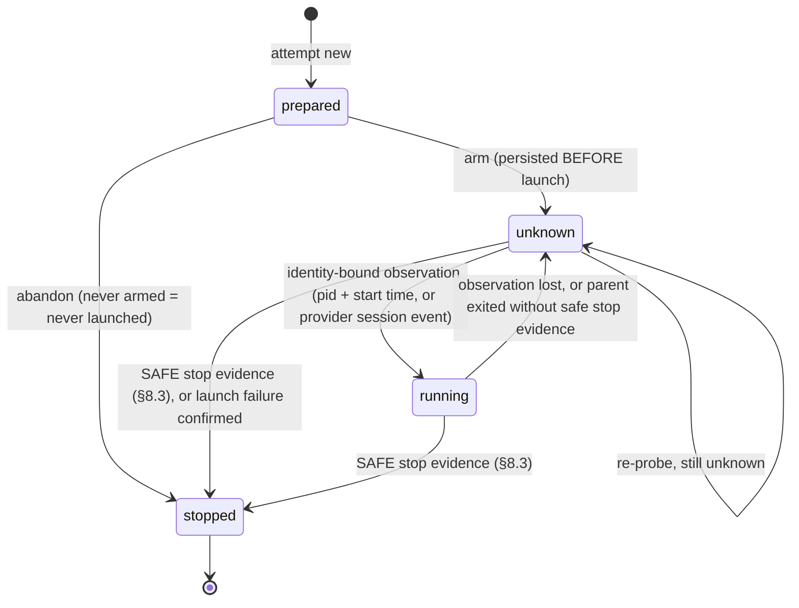

# PDN-0004 — v0.5 acceptance and interrupted-dispatch recovery

| | |
|---|---|
| **Status** | Accepted ([#14](https://github.com/vunm-io/passdown/pull/14)); implementation in progress on `release/v0.5.0` (§26) |
| **Date** | 2026-09-21 |
| **Issue** | [#12](https://github.com/vunm-io/passdown/issues/12) |
| **Architecture** | [RFC #10](https://github.com/vunm-io/passdown/issues/10): Round 3 synthesis and final Claude/Codex dispositions |
| **Baseline** | [#13](https://github.com/vunm-io/passdown/pull/13), merged as `1a9ee38` (PDN-0003, delegated completion authority) |
| **Author** | Claude (primary implementer) |
| **Reviewer** | ChatGPT |
| **Revision** | r3 — addresses the [first](https://github.com/vunm-io/passdown/pull/14#issuecomment-5757998644) and [second](https://github.com/vunm-io/passdown/pull/14#issuecomment-5758817455) design reviews |

**r2 changes.** (1) The serial-writer guard is replaced by an atomic
**writer claim** keyed by the *target* repository, shared by every planner
that can write there (§10.4). (2) `stopped` now means **safe writer
termination**. A parent exit that cannot rule out surviving descendants stays
`unknown` and keeps the claim (§8.3). (3) Re-emit, continuation and salvage
**inherit the claim and the chain's root baseline**. A re-emit's no-new-writes
check compares the chain artifact before and after it runs (§12.4). Q1–Q5 are
resolved as the review recommended (§27).

**r3 changes.** (1) Every receipt mutation is a **locked compare-and-write**
under a per-receipt lock. `rev` is stale-client detection, not the lock.
Claim acquire, transfer and release are specified as **crash-consistent**
sequences: the claim file is the authority, receipt `claim` fields are
repairable projections, and `arm` verifies the claim file (§10.4).
(2) A `read` attempt is claim-free only with an **enforced** mutation guard
measured in the card. Otherwise it takes the claim like a writer. The host
does not touch a location while any attempt holds its claim (§16). (3) Claims
are **repository-local** (`repo`, `loc:`). Ports, daemons, databases and
global caches are not claimable, and tasks that depend on them are serialized
by host policy (§16). Re-emit now rejects `O` before `R` is created, which
removes the `superseded` crash window (§12.4).

This document turns the accepted RFC #10 architecture into a bounded
technical design and an implementation plan. It does not reopen the RFC.
Where this design makes a choice the RFC left open, the choice is marked
**Decision** and the alternatives are listed in §25.

Key words MUST, MUST NOT, SHOULD and MAY are normative.

---

## 1. Context

Passdown v0.4.0 plus the merged PDN-0003 fix already guarantees one
thing: **a delegated worker never accepts its own work.** The host assigns an
exact task reference, forbids plan edits in the prompt, diffs the plan against
a pre-dispatch baseline, runs its own verification, and writes a
`Dispatched: … — accepted; verified: …` line before ticking the checkbox.
Handoff and pickup share one accepted-verdict rule.

What v0.4.x cannot do is survive an interruption. Everything between
"host decides to dispatch" and "host writes the `Dispatched:` line" lives in
the host session only:

- If the host dies after launching a worker, nothing on disk says a worker
  exists, where it runs, or what it was told. The next session cannot tell
  "never launched" from "still writing".
- The worker's report is free text. Nothing binds it to the attempt that
  produced it, the task revision it answered, or the artifact it describes.
- The verdict is bound to nothing but a prose check name. A task edited after
  verification still looks accepted.
- The dispatch skill treats silence as failure ("a stale running status is a
  failure — cancel … and escalate"). That conflates *unknown* with *failed*
  and invites a second writer on top of a live one.
- Mechanical steps (unique IDs, digests, transition checks) are left to a
  model following prose. The PDN-0003 bug is the precedent: the prose
  contradicted itself and 47 text-presence checks still passed.

Current source this design starts from (`main` at `1a9ee38`):

| File | Relevant behavior today |
|---|---|
| `plugins/passdown/skills/passdown-dispatch/SKILL.md` | Execution gate; "route to the cheapest executor"; completion authority; 9-step dispatch contract; baseline + restore; `Dispatched:` verdict lines; stale-job = failure; executor invocation table inline. |
| `plugins/passdown/skills/passdown-pickup/SKILL.md` | Read-only briefing; flags `[x]` without an accepted verdict as *inconsistent* / *unconfirmed*. |
| `plugins/passdown/skills/passdown-handoff/SKILL.md` | Syncs checkboxes to accepted work only; unverified delegated work named in Caveats. |
| `schemas/passdown/schema.yaml` | `apply.instruction` tells an assigned worker not to edit `tasks.md`. |
| `templates/plan.md` | `[dispatch: …]` tags, `Dispatched:` example line. |
| `tests/*.sh` | Bash 3.2, shellcheck-clean; text-contract checks plus one behavioral OpenSpec check. |

## 2. Goals

1. A durable **attempt receipt** exists before any delegated worker can
   start, outside any disposable worktree.
2. Two host-owned state dimensions — **execution observation** and
   **acceptance verdict** — with a written transition table that a
   deterministic helper enforces.
3. A small versioned **worker result** JSON contract that the host validates,
   whatever the provider does natively.
4. Acceptance bound to the exact **task digest**, the exact inspected
   **artifact digest** and host **verification evidence**, persisted
   **before** the plan checkbox is projected.
5. `passdown-pickup` surfaces every unresolved attempt with a recovery class
   and a safe proposed action. Nothing uncertain is retried automatically.
6. Serial scheduling by default; worktree-per-attempt for the simple class;
   concurrency only with a declared profile.
7. Routing ladder with a recorded reason. Depth-one cross-provider delegation.
8. Volatile provider mechanics move into versioned **executor reference
   cards** whose capabilities are *measured*, not copied from docs.
9. Release evidence from **behavior**: deterministic fixtures plus induced
   interruptions. Gate: zero false acceptance, zero silent duplicate
   overlapping writers.

## 3. Non-goals

Not in v0.5, restated from #12 so a reviewer can check the design against it:

- a Passdown daemon, runtime, scheduler or process supervisor;
- a generic ACP client, an MCP job server, A2A;
- a Beads (or any other) task backend, or a second task database;
- an editable Task Capsule;
- a universal capability taxonomy;
- a mandatory cross-vendor reviewer;
- automatic failover or automatic retry of uncertain writers;
- dashboards or telemetry.

Also out of scope: tamper-*proof* receipts (§24), controlling
provider-native descendants that the transport cannot observe (§4 I-12), and
a live question channel (§14).

## 4. Design invariants

Each invariant names the mechanism that enforces it. "Helper" means the
deterministic helper in §10; "fixture" means a scenario in §20.

| # | Invariant | Enforced by |
|---|---|---|
| I-1 | A delegated worker never accepts its own work; its result is evidence. | PDN-0003 prose (kept), helper `verdict` is host-only, fixtures F1/F2 |
| I-2 | The planner owns task intent; receipts reference it and never copy it as editable truth. | Receipt stores task *ref + digest* only (§6) |
| I-3 | An attempt has a durable identity before launch. | `attempt new` must precede `attempt arm`; `arm` must precede launch (§11) |
| I-4 | Provider session ID ≠ attempt ID. Retry and continuation create a new attempt, even inside one provider session. | Receipt `handle` vs `id`; `new --continues` (§14) |
| I-5 | Execution observation ∈ {prepared, running, stopped, unknown}; verdict ∈ {pending, accepted, rejected}; worker disposition lives only in the validated result. | Receipt schema + helper transition table (§8) |
| I-6 | `unknown` is neither success nor failure. Silence is not failure. | Helper has no `unknown → failed` path; dispatch prose change (§21) |
| I-7 | A cancellation request does not prove termination. | `cancel` records a request; only `observe stopped` with safe-stop evidence ends execution (§15) |
| I-8 | A writing attempt may be accepted only when execution is **stopped + reconciled**. `accepted + {prepared, running, unknown}` is invalid. | Helper `verdict accept` preconditions (§12) |
| I-9 | `rejected + {running, unknown}` is valid and keeps ownership risk. | Helper allows it; the writer claim stays held (§10.4) |
| I-10 | Acceptance is bound to task digest, artifact digest and verification evidence. | Helper recomputes both digests at `verdict accept` (§12) |
| I-11 | The verdict is persisted before the plan checkbox is projected. | Ordering in §12; helper `projected` refuses without a persisted accepted verdict |
| I-12 | An unresolved writer retains ownership risk; no overlapping writer starts while one is unresolved. `stopped` means safe writer termination, so a parent exit that cannot rule out surviving descendants is not `stopped`. | Atomic writer claim keyed by target repo (§10.4); safe-stop evidence rule (§8.3) |
| I-13 | Uncertain writes are never retried automatically. | Pickup is read-only; reconcile needs a human-visible host action (§13) |
| I-14 | Environment/permission denial maps to `blocked` and never widens privileges automatically. | Result schema `blocker`; dispatch prose (§11) |
| I-15 | Receipts and results live outside disposable worktrees. | Default store in the Git common dir; helper refuses a store inside the attempt's worktree (§5) |
| I-16 | Acceptance inspects the actual submission, including uncommitted and untracked output. | Helper `inspect` artifact definition (§12.2) |
| I-17 | A malformed result gets at most one no-new-writes re-emit, with unchanged artifact digest. | Helper refuses a second re-emit in a chain; claim transfer + chain-artifact comparison before/after the re-emit (§12.4) |
| I-18 | Passdown-controlled cross-provider depth is 1. | Prompt clause + helper refuses `new --tier external` when `PASSDOWN_ATTEMPT` is set (§17) |
| I-19 | Behavior, not prompt-text presence, decides whether the protocol works. | Fixture harness is the release gate (§20) |
| I-20 | Two `new` calls can never both obtain write authority over the same target resource, whichever planner store they come from, and write authority is not released by a process exit. | Claim acquisition inside the target repo's claim mutex; release only through the helper on resolution or explicit attested release (§10.4) |

## 5. File/artifact layout

### 5.1 Attempt store

**Decision:** the default attempt store is

```text
$(git -C <planner-repo> rev-parse --git-common-dir)/passdown/attempts/
```

— that is, `.git/passdown/attempts/` of the repository that holds the plan.
Override with a new config key `attempt_dir` (§21).

Why the Git common dir:

- It is shared by the main checkout and **every** linked worktree of the
  repository, and removing any worktree does not touch it. A host that itself
  runs in a linked worktree (common for agents) therefore still writes
  outside anything disposable. A store under the checkout's working tree
  (`<repo>/.passdown/`) fails exactly that case.
- It is never committed, so receipts never create commit noise or merge
  conflicts, and `git clean -fdx` cannot delete them.
- It needs no `.gitignore` edit in consumer repositories.

Costs: it is hidden from people browsing the tree (the helper's `list` and
pickup make it visible), and it does not travel between machines. The second
cost is acceptable: an in-flight attempt is a fact about one machine, and a
different machine could not reconcile a process it cannot see. Handoff logs,
which do travel, name unresolved attempt IDs (§13.4).

The helper MUST refuse a store path that is inside the attempt's own
execution worktree, and SHOULD warn when the store is inside any linked
worktree's working tree.

The attempt store records **attempts**. It is not where write authority
lives. Write authority is a *claim* in the **target** repository (§5.6,
§10.4), because two planners with different stores can target the same
repository.

### 5.2 Per-attempt directory

```text
<attempt_dir>/
  <attempt-id>/
    .lock/              # receipt lock, held only inside one helper invocation (§10.4)
    receipt.json        # host-owned; mutated only through the helper
    baseline.json       # immutable after `new`: HEAD + dirty-path snapshot
                        # (for a chained attempt: a pointer to the chain root's baseline, §12.2)
    task.md             # immutable copy of the normalized task block at `new`
    prompt.md           # immutable: exact prompt sent (for re-emit/continuation)
    transport.log       # host-captured stdout/stream of the worker (append-only)
    result.raw          # host-extracted final payload, as received
    result.json         # validated result (written only if validation passes)
    inspect.json        # changed-path set + per-path content hashes, per inspection
    checks/             # host verification outputs (one file per check)
```

The worker is never told this path (§24). The host captures the worker's
output itself (shell redirect or provider stream), so the worker has no reason
to write into the store.

### 5.3 Attempt ID

**Decision:** `pd-<UTC yyyymmddThhmmssZ>-<8 lowercase hex>`, e.g.
`pd-20260921T101530Z-3f9a1c2e`. Generated by the helper from the clock plus
8 random hex digits from `/dev/urandom`; `new` fails if the directory already
exists (mkdir is the uniqueness check). The ID sorts by creation time and
carries no task semantics — the task lives in the receipt. The RFC's
illustrative `pdn-0003-2.1-a2` form was rejected because allocating `a<N>`
requires reading and counting existing attempts, which races.

### 5.4 Plan projection

The canonical plan keeps the v0.4.x `Dispatched:` line and gains an attempt
reference at the end:

```markdown
- [x] 2.1 Add receipt schema [dispatch: external-ok]
  - Dispatched: kiro-cli (2026-09-22) — accepted; verified: tests/receipt.sh; attempt: pd-20260922T081200Z-3f9a1c2e
```

The attempt reference sits after the check so a v0.4.x reader, whose rule is
"`accepted` and a host check after `verified:`", still parses the line.

### 5.5 Repository layout added by v0.5

```text
schemas/protocol/receipt.v1.schema.json     # canonical contract
schemas/protocol/result.v1.schema.json      # canonical contract
scripts/passdown-attempt                    # canonical helper source
scripts/sync-bundled.sh                     # copies helper + schemas into skills
plugins/passdown/skills/passdown-dispatch/
  scripts/passdown-attempt                  # bundled copy (CI: byte-identical)
  schemas/result.v1.schema.json             # bundled copy, handed to providers that enforce schemas
  references/executors/{claude,codex,kiro-cli}.md
plugins/passdown/skills/passdown-pickup/scripts/passdown-attempt    # bundled copy
plugins/passdown/skills/passdown-handoff/scripts/passdown-attempt   # bundled copy
tests/attempt.sh                            # helper unit + transition tests
tests/fixtures/attempt/{receipts,results}/  # valid/invalid corpus
tests/harness/                              # reference host + fake executor (test-only, never shipped)
tests/interrupt.sh                          # interruption matrix (§20)
```

Bundled copies exist because each install channel (Claude plugin, Codex
plugin, Kiro direct copy) ships skill directories wholesale, and a skill can
reliably address files inside its own directory (Q2, resolved in §27).

### 5.6 Writer-claim namespace

```text
$(git -C <target-repo> rev-parse --git-common-dir)/passdown/claims/
  .mutex/               # claim mutex: short critical section held by one helper process (§10.4)
    owner               # helper pid + start time, for breaking a dead helper's mutex
  repo.json             # exclusive single-writer claim for the whole target repo, or absent
  loc/<worktree-hash>.json  # per-worktree claims, only under a concurrency profile
  history/              # released claim files, kept for audit and projection repair
```

The namespace holds **repository-local** keys only. Machine-global resources
such as ports and shared caches are deliberately not claimable (§10.4, §16).

The namespace is derived from `place.repo`, the repository the worker writes
into, not from the planner. Every planner and every linked worktree that can
write to that repository resolves the same directory. A claim file records
the holder attempt ID, the absolute path of the holder's attempt store,
`acquired_at`, and the claim history (transfers).

Cross-repository delegated writes (`task.planner_repo ≠ place.repo`) remain
supported. They are safe because the claim lives with the target. A target
that is not a Git repository cannot be claimed, so it cannot receive
delegated writes in v0.5.

## 6. Attempt receipt schema

`receipt.json`, JSON, UTF-8, `schema: "passdown.receipt/v1"`. Fields marked
★ are immutable after `new`.

```jsonc
{
  "schema": "passdown.receipt/v1",                 // ★
  "id": "pd-20260921T101530Z-3f9a1c2e",            // ★
  "rev": 7,                                        // incremented by every helper write
  "kind": "write",                                 // ★ write | read | reemit | salvage
  "continues": null,                               // ★ predecessor attempt ID or null
  "chain_root": "pd-20260921T101530Z-3f9a1c2e",    // ★ first attempt of the chain (itself when continues = null)
  "created_at": "2026-09-21T10:15:30Z",            // ★

  "task": {                                        // ★ whole object
    "ref": "openspec/changes/pdn-0004-x/tasks.md#2.1",
    "planner_repo": "/abs/path/to/repo",
    "digest": "sha256:…",                          // normalized task block, §12.1
    "inputs": [ { "path": "openspec/changes/pdn-0004-x/specs/a/spec.md", "digest": "sha256:…" } ],
    "paths": ["scripts/", "tests/attempt.sh"]      // declared scope from the task's Paths field
  },

  "host": {                                        // ★
    "agent": "claude",                             // host name, as in handoff frontmatter
    "session": "…",                                // host session ID if the host exposes one, else null
    "passdown_version": "0.5.0"
  },

  "route": {                                       // ★
    "tier": "external",                            // current | native | external
    "reason_code": "required-environment",         // §17
    "reason": "needs Gradle daemon only configured in kiro profile"
  },

  "executor": {                                    // ★ except `version`/`engine` may be filled at first observation
    "name": "kiro-cli",
    "card": "kiro-cli@1",                          // executor reference card + card version
    "version": "2.22.1",
    "engine": "…",                                 // model/engine if observable, else null
    "invocation_digest": "sha256:…"                // digest of the exact argv template used
  },

  "place": {                                       // ★
    "repo": "/abs/path/to/target-repo",
    "base_ref": "main",
    "base_commit": "1a9ee38…",
    "isolation": "worktree",                       // current-checkout | worktree | read-only
    "profile": null,                               // concurrency profile name, §16
    "location": "/abs/path/to/worktree"            // where the worker runs
  },

  "handle": {                                      // set by the host after launch
    "pid": 48211,
    "pid_started": "Mon Sep 21 10:15:31 2026",     // `ps -o lstart=`, binds pid to this process
    "pgid": 48211,
    "provider_session": "…",                       // provider's session ID if it prints one
    "runner": null,                                // e.g. an acpx session later; null in v0.5
    "containment": "pgroup",                       // pgroup | scope (cgroup / systemd-run / job object) — how the host launched it
    "parent_exited_at": null                       // set when the launched process exits but safe stop is not established
  },

  "claim": {                                       // write authority, §10.4; null for kind = read
    "namespace": "/abs/target/.git/passdown/claims",
    "key": "repo",                                 // "repo", or resource keys under a profile
    "state": "held",                               // requested | held | transferred | released (projection; claim file is authoritative)
    "acquired_at": "…",
    "transferred_to": null,                        // successor attempt ID
    "released_at": null,
    "release_basis": null                          // resolved | attested (+ who)
  },

  "execution": {
    "observation": "stopped",                      // prepared | running | stopped | unknown
    "observed_at": "2026-09-21T10:31:02Z",
    "stop_evidence": "exit+pgroup-empty",          // §8.3 safe-stop evidence; null unless stopped
    "exit": { "code": 0, "signal": null },
    "cancel_requested_at": null,
    "cancel_method": null,
    "reconciled_at": "2026-09-21T10:31:40Z"        // set by `inspect` after stopped
  },

  "result": {
    "ref": "result.json",                          // null until a valid result is stored
    "disposition": "submitted",                    // copied from result.json for listing only
    "status": "valid",                             // none | valid | invalid
    "diagnostics": [],                             // validation errors when invalid
    "source": null                                 // "reemit:<id>" when a re-emit supplied it
  },

  "artifact": {
    "at_arm": "sha256:…",                          // chain artifact digest just before launch
    "digest": "sha256:…",                          // chain artifact digest from the latest `inspect`
    "expected": null,                              // reemit only: must equal digest and at_arm
    "changed": 3,
    "out_of_scope": [],                            // paths outside task.paths
    "plan_touched": false                          // worker edited the plan file
  },

  "verdict": {
    "acceptance": "accepted",                      // pending | accepted | rejected
    "reason_code": null,                           // required when rejected, §8.4
    "reason": null,
    "task_digest": "sha256:…",                     // recomputed at verdict time
    "artifact_digest": "sha256:…",                 // recomputed at verdict time
    "checks": [ { "name": "tests/attempt.sh", "exit": 0, "output": "checks/1.txt" } ],
    "integration": { "into": "/abs/host/checkout", "head": "…" },  // when the done criteria need the integrated tree
    "at": "2026-09-21T10:33:10Z",
    "projected_at": "2026-09-21T10:33:25Z"         // plan checkbox + Dispatched line written
  },

  "transitions": [                                 // append-only audit, written by the helper
    { "rev": 2, "field": "execution.observation", "from": "prepared", "to": "unknown", "at": "…", "note": "arm" }
  ]
}
```

Rules:

- The receipt is **secret-free**: no environment dump, no credentials, no
  tokens. `prompt.md` and `transport.log` may contain whatever the task text
  and tools printed; they stay in the local store and are never copied into
  the plan, the handoff or a PR (§24).
- No task intent is duplicated in an editable form. `task.md` is an immutable
  snapshot used only for staleness diagnostics and rehydration.
- Every mutation is a **locked compare-and-write** (§10.4). The helper takes
  the receipt lock `<attempt dir>/.lock/`, re-reads the receipt inside the
  lock, compares `--rev N`, validates the transition, writes `rev + 1` via tmp
  file + `mv`, and releases the lock. `rev` detects stale clients; the lock
  makes the check-and-write indivisible. An atomic rename alone would not:
  two hosts that both read revision 7 would both rename a revision 8.
- The `claim` object is a projection of the authoritative claim file in the
  target namespace (§5.6, §10.4).

**Contract refinements (S1).** The published schemas in `schemas/protocol/`
are the normative field list; they refine the sketch above without changing
its semantics:

- `place.mutation_guard` records `new --mutation-guard` (`readonly:<m>` or
  `snapshot+sandbox`, read attempts only). `claim` is `null` exactly for a
  read attempt with a guard.
- `execution.attested_by` records who attested an `owner-attested` stop.
- `handle.scope` names the containment scope (an absolute cgroup v2
  directory) when `containment = scope`, so `probe` can check it is empty.
- `artifact.inspections[]` keeps every `inspect` (time + digest) for the
  settle check (§12.3 rule 4); `artifact.overlaps_baseline[]` lists
  pre-existing dirty paths the attempt changed (§12.2);
  `artifact.target_at_arm` / `target_after` hold the target-tree digests of a
  claim-free read (§16).
- `verdict.scope_override` records the `--scope-override` reason.
- `route.reason_code` is `host-work` for `tier = current` (salvage and
  host continuations).
- `result.diagnostics` adds `structure` (a missing member or wrong type) to
  the §7 codes.
- A `loc:` claim key is `loc:` plus the first 16 hex digits of the SHA-256 of
  the attempt's absolute worktree path.
- Timestamps are UTC with second precision (`YYYY-MM-DDTHH:MM:SSZ`).

Rules that compare two values, depend on the executor card or span files
(digest equality, `chain_root`, the transition log, safe stop evidence per
card, one holder per claim key) are not expressible in JSON Schema. The
helper enforces them, and the fixture corpus keeps them in a separate
`semantic-invalid/` layer (`tests/fixtures/attempt/README.md`).

## 7. Worker result schema

`schema: "passdown.result/v1"`. The worker returns this as its **final
payload**; the executor card says how the host extracts it from the provider's
envelope (§18). The host never scans a transcript for whichever JSON fragment
happens to validate.

```jsonc
{
  "schema": "passdown.result/v1",
  "attempt": "pd-20260921T101530Z-3f9a1c2e",       // MUST equal the receipt ID
  "disposition": "submitted",                      // submitted | needs_input | blocked | failed
  "summary": "Added receipt schema and tests.",    // ≤ 2000 chars
  "changed_paths": [                               // claims; the host inspects independently
    { "path": "schemas/protocol/receipt.v1.schema.json", "change": "added" },
    { "path": "tests/attempt.sh", "change": "modified" }
  ],
  "evidence": [                                    // what the worker ran and saw
    { "kind": "command", "command": "tests/attempt.sh", "exit_code": 0, "observed": "1..42" }
  ],
  "assumptions": ["receipt timestamps are UTC"],
  "caveats": [],
  "question": null,                                // REQUIRED object iff needs_input
  "blocker": null                                  // REQUIRED object iff blocked
}
```

Conditional members:

```jsonc
"question": { "text": "Should re-emit reuse the provider session?",
              "options": ["reuse", "fresh"],        // optional
              "context_paths": ["docs/design/…"] }  // optional
"blocker":  { "kind": "permission",                 // permission | sandbox | network | tool-missing | other
              "message": "<verbatim error>" }
```

Validation rules (all deterministic, all in the helper):

| Rule | Failure diagnostic |
|---|---|
| Parses as a single JSON object, ≤ 256 KiB | `parse` |
| `schema` is exactly `passdown.result/v1` | `schema-version` |
| `attempt` equals the receipt ID | `attempt-mismatch` |
| `disposition` in the enum | `disposition` |
| `question` present and non-empty iff `needs_input` | `question` |
| `blocker` present iff `blocked` | `blocker` |
| Every `changed_paths[].path` is relative, normalized, no `..`, no leading `/` | `path` |
| No members beyond the schema, except under `x_`-prefixed keys | `unknown-member` |
| String lengths within limits | `length` |

A result that fails any rule is stored as `result.raw` with
`result.status = invalid` and its diagnostics. It never becomes
`result.json`. What happens next is §12.4.

`failed` carries no extra member; its `summary` and `evidence` explain it.

## 8. State semantics and valid/invalid combinations

### 8.1 Execution observation



| From \ To | prepared | unknown | running | stopped |
|---|---|---|---|---|
| **prepared** | — | ✅ `arm` | ❌ must arm first | ✅ `abandon` (evidence `not-launched`) |
| **unknown** | ❌ | ✅ re-probe / parent exited | ✅ identity-bound evidence required | ✅ safe stop evidence required |
| **running** | ❌ | ✅ observation lost / parent exited without safe evidence | — | ✅ safe stop evidence required |
| **stopped** | ❌ | ❌ | ❌ | — (terminal) |

The launch-window rule is the core of recovery: `prepared` is persisted, then
`unknown` is persisted **before** the launch command is issued, then `running`
only once the host holds an observation bound to that process. Consequences:

- **`prepared` proves the worker was never launched**, as long as the host
  followed the protocol. Pickup may therefore offer to abandon it safely.
- A crash between launch and saving the handle leaves `unknown`. That window
  is deliberately uncertain, never assumed empty.
- `stopped` is terminal. A worker that must continue gets a new attempt.

### 8.2 Acceptance verdict

| From \ To | accepted | rejected |
|---|---|---|
| **pending** | ✅ only if §12 preconditions hold | ✅ any time |
| **accepted** | — | ❌ (terminal; see §8.5) |
| **rejected** | ❌ | — (terminal) |

### 8.3 Stop evidence: `stopped` means safe writer termination

`stopped` is not "the launched process exited". It means **no process
started for this attempt can still write**. That is the RFC's "safely
stopped". The helper refuses `observe stopped` unless the evidence is **safe**
for this executor according to its card (§18):

| Evidence | What the host observed | Safe when |
|---|---|---|
| `not-launched` | From `prepared` (never armed), or a launch failure the host saw directly (e.g. `ENOENT`, the adapter refused before spawning) | Always |
| `exit+scope-empty` | The worker was launched inside an OS containment scope that no process can leave (Linux cgroup / `systemd-run --scope`, a Windows job object), the launched process exited, and the scope is empty | Always. It is the only machine evidence that rules out detached descendants |
| `exit+pgroup-empty` | The launched process exited and no process remains in its process group | Only if the card records `descendants_may_outlive: unsupported`, i.e. it was **measured** that the executor does not detach (`setsid`, daemonize, background agents) |
| `owner-attested` | A named person confirmed no writer remains (after checking processes, or after a reboot) | Always. Recorded with who and when |

What is **not** stop evidence:

- a bare parent exit (`exit`) or the provider's terminal event, when
  descendants cannot be ruled out;
- a quiet period with an unchanged artifact digest. That is **artifact
  stability** evidence, and §12.3 still requires it before acceptance, but it
  cannot prove that a detached process will not write later.

When the parent exits and the evidence is not safe, the host records
`observe unknown --parent-exited`, which sets `handle.parent_exited_at`. The
observation stays `unknown`, the attempt keeps ownership risk, and its writer
claim stays held (§10.4). Because every card starts with
`descendants_may_outlive: unverified`, attempts on an unmeasured executor end
this way until the owner attests or the host launched them in a scope. This
cost is deliberate: E-KIRO-1 part E (§19) and the equivalent measurement for
the other cards are what remove it.

`probe` reports the facts (`pid` alive with the same start time, process
group empty, scope empty). The helper decides whether those facts are safe for
the card; the host cannot pass a weaker evidence value.

### 8.4 Rejection reason codes

`invalid_result`, `verification_failed`, `scope_violation`, `plan_tampered`,
`needs_input`, `blocked`, `worker_failed`, `stale`, `abandoned`, `cancelled`,
`integration_failed`, `reemit_wrote`.

`rejected` is a verdict on **one attempt's submission**, never on the task.
`needs_input` and `blocked` use `rejected` because the submission is not
acceptable as completion; the task stays open and a continuation follows.
The reason code is mandatory for every rejection. Anything shown to humans
(pickup briefing, handoff, `Dispatched:` line, `list` output) renders the
reason, not the bare verdict: **needs input**, **blocked**, and so on, never
just "rejected".

Some reasons **hold the writer claim** after rejection because the attempt's
output is still in the location and a follow-up attempt is expected:
`needs_input`, `blocked`, `invalid_result`, `reemit_wrote`,
`integration_failed`. The claim moves on by transfer to a continuation,
re-emit or salvage, or by an explicit attested release (§10.4). Every other
reason releases the claim once the attempt is resolved.

### 8.5 Combination table

Worker disposition is shown for completeness; it is not host state.

| Observation | Verdict | Valid? | Meaning / what pickup does |
|---|---|---|---|
| prepared | pending | ✅ | Created, never armed → never launched. Offer `abandon`. |
| prepared | accepted | ❌ | Invalid. Nothing ran. |
| prepared | rejected | ✅ | Abandoned before launch (after `abandon` it becomes stopped/rejected). |
| unknown | pending | ✅ | Launch or observation uncertain. **Ownership risk.** Probe; never retry. |
| unknown | accepted | ❌ | Invalid (I-8). |
| unknown | rejected | ✅ | Rejected but writer may live. **Ownership risk.** Claim held. |
| unknown (`parent_exited_at` set) | any non-accepted | ✅ | Parent exited, descendants not ruled out (§8.3). **Ownership risk.** Claim held. |
| running | pending | ✅ | Live writer. Wait, or request cancel. |
| running | accepted | ❌ | Invalid (I-8). |
| running | rejected | ✅ | Rejected while live. **Ownership risk** until stopped. |
| stopped | pending, no valid result | ✅ | Crash after exit, or malformed/missing result. §12.4. |
| stopped | pending, valid result | ✅ | Ready for acceptance lifecycle (§12). |
| stopped | accepted, not projected | ✅ | Crash between verdict and checkbox. Repair projection (§13). |
| stopped | accepted, projected | ✅ | Resolved. |
| stopped | rejected | ✅ | Resolved. Claim released, or held for a follow-up if the reason is claim-holding (§8.4). |
| stopped with `exit` / provider-event evidence only | any | ❌ | Invalid: not safe stop evidence (§8.3). |
| any | claim `held` while another attempt holds the same key | ❌ | Invalid: two write authorities (I-20). |
| any | accepted without `reconciled_at` | ❌ | Invalid (I-8). |
| any | accepted without artifact digest or ≥1 check | ❌ | Invalid (I-10). |
| any | accepted with `task_digest ≠ task.digest` | ❌ | Invalid: accepted against another revision. |
| — | result `needs_input` without `question` | ❌ | Invalid result (§7). |
| — | result `attempt ≠ id` | ❌ | Invalid result. |

**Resolved** = `observation = stopped` **and** `verdict ≠ pending` **and**
(`verdict = accepted` ⇒ `projected_at` set). Everything else is unresolved.
**Ownership risk** = `observation ∈ {running, unknown}`, whatever the verdict.
**Write authority** = holding the writer claim (§10.4). Ownership risk always
implies a held claim. A held claim can outlive ownership risk: after a
claim-holding rejection, and while `stopped` + `pending`, because the
unaccepted output still sits in the location.

An accepted verdict is never flipped. If later evidence shows it was wrong,
the planner unticks the task, the old receipt remains as history, and a new
attempt does the work again. (A `revoked` state was considered and left out;
§25.)

## 9. Ownership table for every mutable field

Receipt, result and plan fields. "Helper" means written *through* the helper
by the named actor; nobody edits `receipt.json` by hand.

| Field | Written by | When | Worker may write? |
|---|---|---|---|
| receipt ★ fields (`id`, `kind`, `continues`, `chain_root`, `task`, `host`, `route`, `place`, `created_at`) | Host via helper `new` | Once | ❌ |
| `executor.version`, `executor.engine` | Host via helper | `new`, or first observation if only then known | ❌ |
| `handle.*` | Host via helper `observe` | After launch | ❌ |
| `execution.observation`, `observed_at`, `stop_evidence`, `exit` | Host via helper `observe` / `abandon` | Transitions §8.1 | ❌ |
| `execution.cancel_requested_at`, `cancel_method` | Host via helper `cancel` | On cancel request | ❌ |
| `execution.reconciled_at`, `artifact.*` | Helper `inspect` (host-invoked) | After `stopped` | ❌ |
| `result.*` and `result.json` | Helper `result` (host-invoked) from host-captured payload | After extraction | ❌ (worker authors the *payload*, not the file) |
| `verdict.*` except `projected_at` | Host via helper `verdict` | §12 | ❌ |
| `verdict.projected_at` | Host via helper `projected` | After the plan edit | ❌ |
| Claim files under the target repo's `passdown/claims/` (authoritative), and `claim.*` in receipts (projection) | Helper only, inside the claim mutex: acquired by `new`, transferred by `new --continues`, released on resolution or by `release-claim`; projections repaired from the claim file | §10.4 | ❌ |
| `rev`, `transitions[]` | Helper only | Every write | ❌ |
| Result payload (disposition, claims, evidence, question, blocker) | Worker | Final output | ✅ — this is the worker's only authored artifact besides the task's files |
| Task text, paths, done criteria, verification | Planner (host on planner's behalf) | Plan edits | ❌ |
| Plan checkbox | Host | Only after persisted accepted verdict (I-11) | ❌ |
| `Dispatched:` line | Host | After verdict | ❌ |
| Files inside `task.paths` | Worker | During execution | ✅ |
| Handoff log `open_attempts` | Handoff (host) | End of session | ❌ |

This is a **logical** authority boundary. Files do not enforce access control;
a worker with broad filesystem access can write anywhere. The design detects
violations it can see (plan diff, out-of-scope paths, result attempt
mismatch, receipt `rev`/transition inconsistencies) and does not claim to
prevent them (§24).

## 10. Deterministic helper

### 10.1 Scope

`passdown-attempt` is a **stateless** CLI. Each invocation reads files,
checks rules, writes files atomically and exits. It:

- generates attempt IDs;
- creates receipts and baseline/task snapshots;
- applies validated field transitions;
- computes task and artifact digests;
- validates receipts and results against the v1 contracts;
- detects stale results and invalid combinations;
- lists attempts with a recovery class;
- serializes every receipt mutation under a receipt lock (locked compare-and-write), and acquires, transfers and releases writer claims under the target's claim mutex as crash-consistent sequences (§10.4);
- enforces the depth guard.

It MUST NOT launch, signal, wait for or monitor agents; open network
connections; schedule anything; run in the background; or edit plan files.
The one process-related thing it does is *read-only*: `probe` asks the OS
whether a recorded `pid` still exists with the recorded start time, and
whether its process group or containment scope is empty. It never sends a
signal. The claim mutex is a directory the helper holds for milliseconds
within one invocation. It is a lock, not a background process. (Cancellation signals are sent by the host, per the card.)

### 10.2 Implementation constraints

**Decision:** Bash 3.2-compatible script + `jq` ≥ 1.6 + `git`, shellcheck-clean,
matching the repo's existing tooling and CI.

- macOS ships `/usr/bin/jq` (measured: `jq-1.7.1-apple` on macOS 26.6);
  Linux CI images have it; Windows Git Bash does not ship it (open question
  Q1).
- SHA-256 via `sha256sum`, falling back to `shasum -a 256`.
- JSON Schema files under `schemas/protocol/` are the **published contract**.
  The helper implements the same rules in jq so it has no Node/Python runtime
  dependency. CI runs a conformance test: every fixture in
  `tests/fixtures/attempt/` must get the same valid/invalid verdict from the
  helper and from a pinned JSON Schema validator (dev-only, e.g. `ajv-cli` via
  `npx`). Drift between prose contract and code is then a red build.

### 10.3 Interface

Global options: `--store <dir>` (else resolved from config / Git common dir),
`--json` (machine output). Mutating commands require `--rev <n>`.
Exit codes: `0` ok · `2` usage · `3` invalid transition / precondition failed ·
`4` validation failed · `5` rev conflict · `6` guard refused (claim held / depth).

| Command | Effect |
|---|---|
| `new --task-ref <plan#id> --kind write\|read\|reemit\|salvage --tier current\|native\|external --reason-code <c> --reason <txt> --executor <name> --card <name@v> --place-repo <p> --isolation <i> [--location <p>] [--profile <p>] [--continues <id>] [--input <path>…] [--mutation-guard readonly:<m>\|snapshot+sandbox]` | Allocate ID, snapshot task block + inputs + baseline (or link the chain root's baseline), acquire or transfer the writer claim, write receipt with `prepared`/`pending`, all inside the target's claim mutex. Runs the depth guard. Prints ID. |
| `arm <id> --prompt <file>` | For a claim-needing attempt, verify under the claim mutex that the claim file names this attempt (refuse otherwise). Store the exact prompt as `prompt.md`, then `prepared → unknown`, note `arm`. The host issues the launch command only after this returns 0, so the prompt is always on disk before a worker can exist. |
| `observe <id> running --pid <n> [--pid-started <s>] [--pgid <n>] [--provider-session <s>]` | `unknown → running`. Requires identity: `pid` + start time, or a provider session ID. |
| `observe <id> stopped --evidence <e> [--exit <code>] [--signal <s>] [--attested-by <who>]` | `unknown\|running → stopped`. Refused unless `<e>` is safe for the card (§8.3) and, for machine evidence, a fresh `probe` confirms it. If this makes the attempt resolved and no claim-holding reason applies, the claim is released in the same call. |
| `observe <id> unknown --note <txt> [--parent-exited]` | `running → unknown` (observation lost, or parent exited without safe stop evidence; the flag sets `handle.parent_exited_at`). The claim stays held. |
| `abandon <id>` | `prepared → stopped` with `not-launched`, verdict `rejected/abandoned`. Refused in any other state. |
| `probe <id>` | Read-only. Reports whether `pid` exists with the same start time, whether its process group is empty, whether its containment scope (if any) is empty, and which evidence value the card would accept. Writes nothing. |
| `cancel <id> --method <m>` | Records `cancel_requested_at` and method. Does not change observation. |
| `result <id> --payload <file>` | Validate payload (§7). Valid → `result.json`, `result.status=valid`. Invalid → `result.raw` + diagnostics. A second valid result for the same attempt is refused. |
| `inspect <id>` | Requires `stopped`. Computes the chain artifact against the chain root's baseline in `place.location` (tracked, staged, unstaged, untracked-not-ignored), this attempt's own writes (`digest ≠ at_arm`), scope check against `task.paths`, plan-file touch check. Sets `reconciled_at` on first call; later calls append an inspection. `arm` runs the same computation to set `artifact.at_arm`. |
| `verdict <id> accept --check <name>=<exit>:<output-file>… [--integrated-into <p> --integrated-head <sha>] [--scope-override <reason>]` | Preconditions in §12.1–12.3. Recomputes task and artifact digests. |
| `verdict <id> reject --reason-code <c> --reason <txt> [--check …]` | Allowed in any observation. Releases the claim only if the attempt is then resolved and the reason does not hold the claim (§8.4). |
| `projected <id> --plan <path>` | Requires persisted `accepted`. Reads (never writes) the plan and checks the task block is `[x]` with a `Dispatched:` line naming `attempt: <id>`. Sets `projected_at` and releases the claim. |
| `release-claim <id> --attested-by <who> --reason <txt>` | Explicit release of a claim still held by a **stopped** attempt: a claim-holding rejection whose leftover output the host chooses to abandon, or a dangling claim whose holder's store is gone. Refused while the holder has ownership risk; that must first become `stopped` through `observe` (e.g. `owner-attested`). |
| `claims [--repo <p>]` | Read-only: every claim in the target repo's namespace, with holder attempt, holder store, holder observation/verdict (if the store is readable), age, and whether it is dangling. |
| `digest task --plan <path> --task <id>` / `digest artifact <id>` | Print digests without writing (for pickup and debugging). |
| `validate [<id>…\|--all]` | Schema + invariant check of receipts, including the §8.5 invalid combinations and transition-log consistency. |
| `list [--unresolved] [--task <ref>]` | One line per attempt: ID, task ref, kind, observation, verdict (rendered with reason), result status, projected, ownership risk, claim state, recovery class (§13.2), age. |

Every mutating command is a single guarded transition. There is no generic
`set <field> <value>`: a generic setter would move the transition rules back
into prose, which is the failure mode this helper exists to prevent.

### 10.4 Locks, writer claims and guards in `new`

r1 used a scan-then-create guard over the planner's store. It had two holes.
Two concurrent `new` calls could both scan an empty store and both proceed.
And two planners with different stores could target the same repository
without seeing each other. r2 replaced it with a **writer claim**. r3 makes
the locking underneath it precise. Every check-then-write runs under a lock,
and a change that touches more than one file is specified as
**crash-consistent** with one source of truth. It is not multi-file atomic,
because separate renames cannot be.

#### Locks

The helper uses one primitive, a **directory lock**:

1. `mkdir <lockdir>`. POSIX `mkdir` is atomic, so exactly one helper process
   succeeds. The winner immediately writes `<lockdir>/owner` with its own pid
   and start time.
2. If `mkdir` fails, retry with backoff for up to 10 s. If the existing
   `owner` is a dead process (pid gone, or the start time differs), or there
   is no `owner` file and the lock is older than 30 s, remove the lock and
   retry. This is safe because only helper processes hold these locks, each
   for one short critical section inside a single invocation. A lock is never
   held by a worker or across a launch.
3. Release with `rmdir` (after removing `owner`).

Two kinds of lock exist:

| Lock | Path | Protects |
|---|---|---|
| **Claim mutex** | `<target common dir>/passdown/claims/.mutex/` | All claim files of one target repository |
| **Receipt lock** | `<attempt dir>/.lock/` | That attempt's `receipt.json` and sibling files |

**Lock order** (prevents deadlock): the claim mutex first, if the operation
touches claims; then receipt locks in ascending attempt-ID order. Every
invocation takes all its locks up front and releases them before exiting.

**Every receipt mutation is a locked compare-and-write:**

1. acquire the receipt lock (and the claim mutex first, if claims are
   involved);
2. re-read `receipt.json` **inside** the lock;
3. compare `--rev` with the file's `rev`, and exit 5 on mismatch;
4. validate the transition against the re-read state;
5. write `rev + 1` atomically (tmp file, `fsync` where available, `mv`);
6. release the locks.

`rev` is therefore **stale-client detection**: a host that read revision 7
cannot apply a change planned against it after someone else wrote revision 8.
The lock is what makes the check-and-write indivisible. Races such as
`cancel` vs `observe`, a recovering host vs the original host, or `result` vs
another mutation all serialize on the receipt lock. The loser gets exit 5 and
re-reads.

#### Writer claims

**Source of truth.** The claim file in the target namespace (§5.6) is
**authoritative** for current write ownership. The `claim` object in each
receipt is a **projection** of it. When the two disagree the claim file wins,
and the helper repairs the projection (see *Projection repair* below).

**Who needs a claim.** Every attempt whose execution surface **can mutate the
target**:

- `kind ∈ {write, reemit, salvage}`, always;
- `kind = read`, **unless** its mutation guard is enforced (§16): the worker
  runs under an executor mode that the card measured as unable to write the
  target (a read-only mode or a sandbox confining writes to a separate
  snapshot). A read attempt without an enforced guard is treated as a
  potential writer and must acquire the claim like one. While another attempt
  holds the claim it is refused (fixture F24).

**Claim keys (r3: repository-local only).** Claims coordinate resources that
belong to the target repository, and nothing else:

- Default (no profile): the exclusive key `repo`. One claim-holding attempt
  per target repository, whatever worktree it runs in.
- Under a declared concurrency profile (§16): the key `loc:<worktree path
  hash>`, one per attempt's own worktree. A profile attempt needs `repo` to be
  absent and its `loc:` key to be free. A profile-less attempt needs `repo` to
  be free **and** no `loc:` keys to be held. A profile only replaces the
  single-writer claim with disjoint per-worktree claims, never with nothing.

Machine- or workspace-global resources (ports, daemons, databases, shared
mutable caches) are **not** claimable in v0.5. The target's namespace cannot
coordinate them across repositories, so offering `port:` or `cache:` keys
would promise isolation the mechanism cannot deliver. Tasks that depend on
such resources are not eligible for concurrency profiles and follow the host
serialization rule in §16. The helper rejects a profile that declares any key
other than `loc`.

**Claim states in the receipt projection:** `requested` (the receipt exists,
the claim file does not name it yet) · `held` · `transferred` · `released`.

**Acquire (`new`, no predecessor).** Under the claim mutex:

1. write the new receipt with `claim.state = requested`. The receipt exists
   first, so a claim can never name an attempt without a receipt;
2. check the keys. If they are taken, delete the new attempt directory and
   exit 6, naming the holder and its store;
3. write the claim file naming the new attempt (tmp + `mv`). **This is the
   commit point**;
4. set the receipt projection to `held`.

**Transfer (`new --continues P`, when `P` holds the claim).** Under the claim
mutex, with the receipt locks of `P` and the new attempt `S`:

1. write `S` with `claim.state = requested`;
2. atomically replace the claim file so that it names `S` instead of `P`
   (tmp + `mv`). **This is the commit point**;
3. set `S.claim.state = held`;
4. set `P.claim.state = transferred` and `P.claim.transferred_to = S`.

**Release.** Under the claim mutex, with the holder's receipt lock:

1. move the claim file to `claims/history/<attempt-id>.<n>.json`. **This is
   the commit point**;
2. set the holder's projection to `released`, with `released_at` and
   `release_basis`.

**Armability.** `arm` of any claim-needing attempt MUST verify, under the
claim mutex, that the claim file currently names this attempt. It refuses
otherwise, even if the attempt's own projection says `held`. At most one
attempt per claim key can therefore ever be launched, whatever state the
projections are in after a crash.

**Projection repair.** Every helper invocation that takes a claim mutex first
reconciles the projections of the attempts named in that namespace, and
`validate` reports mismatches without repairing them (pickup stays
read-only). The rules are deterministic because the claim file is the
authority:

| Claim file | Projection found | Repair |
|---|---|---|
| names `S` | `S.requested` | `S → held` |
| names `S` | `P.held`, where `P` is `S.continues` | `P → transferred (to S)` |
| does not name `X` | `X.requested`, `X` still `prepared` | `X → released`, `release_basis = never-committed`. `X` was never armable; pickup shows it as C1 |
| does not name `X`, and `claims/history/` has `X`'s release | `X.held` | `X → released` |
| does not name `X`, no history entry | `X.held` | **Not repaired.** Reported as an inconsistency that needs owner attention (the claim file was removed outside the helper) |

Repair touches receipt projection fields only, and each touch is appended to
`transitions[]`.

Crash consistency, step by step: after any prefix of the acquire, transfer or
release sequence, (a) the claim file names at most one attempt per key, (b)
only that attempt can pass `arm`, and (c) repair brings every projection into
agreement. F23 kills the helper after each sub-step and asserts (a)–(c).

**Release conditions.** A claim is released only:

- by the helper call that makes its holder **resolved** (§8.5), when the
  verdict reason does not hold the claim (§8.4). In practice that is
  `projected`, a non-holding `verdict reject`, or an `observe stopped` on an
  already-rejected attempt;
- by `release-claim --attested-by` on a **stopped** holder;
- never while the holder has ownership risk (`running`/`unknown`, which
  includes a parent that exited without safe stop evidence, §8.3);
- never by a process exit, and never by elapsed time. No lease ever expires a
  claim, because an expired lease on a live writer is precisely the
  duplicate-writer bug.

A claim whose holder *store* is unreadable (deleted clone, unmounted disk) is
never released automatically. It needs `release-claim --attested-by`.

**Transfer is the only way** a re-emit, a salvage, or a continuation after
`needs_input`/`blocked` gets write authority over its predecessor's leftover
output. There is no window in which another attempt can take the key between
the two.

#### Other guards in `new`

- **Continuation guard.** `--continues <P>` requires `P.observation =
  stopped` (safe). By kind:
  - `write` (continuation after `needs_input`/`blocked`): `P` is rejected with
    that reason and still holds the claim;
  - `reemit`: `P` is rejected `invalid_result` (§12.4), still holds the claim,
    and its chain contains no re-emit;
  - `salvage`: `P` is rejected `invalid_result` / `reemit_wrote` /
    `integration_failed` and still holds the claim.

  If `P` no longer holds the claim (it was released), the continuation
  acquires a fresh claim like any other attempt.
- **Re-emit guard.** `kind = reemit` requires the chain to contain no earlier
  `reemit` (I-17).
- **Read guard.** `kind = read` requires `--mutation-guard <enforced
  mechanism>` naming a guard that the executor card marks `verified`, or else
  it acquires a claim (see *Who needs a claim*).
- **Depth guard.** Refuse `--tier external` when the environment variable
  `PASSDOWN_ATTEMPT` is non-empty (the host exports it into every worker it
  launches). This is best effort, because a provider may not propagate the
  environment. The prompt clause is the primary rule (§17).

There is no `--force` on any guard.

**Limits.** `mkdir` atomicity is the POSIX local-filesystem guarantee. A Git
common dir or attempt store on a network filesystem with weak `mkdir`
semantics is outside the v0.5 guarantee, and the helper warns when it detects
one (`df -T`/`stat -f` type check where available). Claims coordinate Passdown
helpers. They do not stop a human, or a tool that ignores Passdown, from
writing into the same checkout (§24).

### 10.5 Implementation notes (S2)

Choices made while building `scripts/passdown-attempt`. None changes the
protocol above; each one makes a rule concrete.

- **One set of rules.** The helper does not re-implement the contract. It
  evaluates the published `schemas/protocol/*.json` with a small built-in
  JSON Schema evaluator written in jq, plus the invariants JSON Schema cannot
  express. `tests/attempt.sh` checks that it reports the same verdict and the
  same error locations as ajv on every fixture.
- **Every write is validated.** `mutate` checks the new receipt against the
  schema and the invariants before the rename. A claim release touches the
  claim namespace only after that check passes, so a refused command can never
  leave a released claim behind.
- **Store resolution.** `--store`, else `PASSDOWN_ATTEMPT_DIR`, else
  `<git common dir of the current directory>/passdown/attempts`. The skills
  resolve the `attempt_dir` config key and pass `--store`.
- **Task scope.** `task.paths` comes from the task's `- Paths:` sub-bullet,
  split on commas. A task with no declared paths puts every changed path out
  of scope (fail closed). A read attempt's artifact is measured in the target
  repository, and every path it changed is out of scope.
- **The plan is not part of the submission.** It is left out of the chain
  artifact, because the host legitimately appends `Dispatched:` lines (a
  rejection before a continuation or a re-emit) while the chain still holds
  the claim. Plan integrity is `plan_touched`: the canonical plan's normalized
  digest against the chain root's baseline, and in a worktree any change to
  the worker's copy. The normalized plan keeps the attempt's own checkbox
  (a worker tick is `plan_touched`, F1) but leaves out the attempt's own task
  text: an edit there already makes the task digest stale, and the host
  cannot tell a planner's edit (F6) from a worker's (F3), so both end as
  `stale`.
- **Artifact digest form.** One compact JSON line
  `{"path":…,"status":…,"hash":…}` per changed path, sorted by path, each line
  LF-terminated, hashed with SHA-256. `status` is Git's name-status letter
  (`A`, `M`, `D`; untracked files are `A`) or `reverted` for a baseline-dirty
  path restored to its committed content. `hash` is `git hash-object`,
  `deleted`, or `dir:<HEAD>` for a nested repository. Golden values are in
  `tests/fixtures/attempt/golden/`.
- **Card snapshot.** `new` copies the executor card (`card.md`, parsed as
  `card.json`) into the attempt directory. Safety decisions for the attempt
  read that copy, so a later card edit cannot change them. A missing card
  means every capability is `unverified`.
- **Abandon with writes.** `abandon` measures the location first. If it shows
  changes since the baseline, a worker may have run without `arm` (C1 → C2),
  and `abandon` requires `--attested-by`, recording `owner-attested` evidence.
- **Repairs are not conflicts.** When the claim mutex repairs a projection
  during the same invocation, a client that planned against the pre-repair
  `rev` is not treated as stale.
- **Locks.** A lock without an `owner` file counts as stale after one minute
  (the portable `find -mmin` granularity), not 30 s. A lock wait times out
  after 10 s with exit 5.
- **A killed `new`.** After the claim-file commit point, a killed `new`
  leaves a `prepared` attempt that holds the claim. Repair makes its
  projection `held` (§10.4 table), and pickup shows it as C1: the host
  abandons it. It is not reclaimed automatically; the C11 row below is
  worded accordingly.
- **Windows (Git Bash).** Git Bash rewrites every argument that looks like a
  POSIX path before a native program sees it. `git.exe` needs that, but
  `jq.exe` must receive values such as `--arg p /holder` verbatim. The helper
  therefore wraps `jq`. For jq alone it turns the conversion off, converts
  exactly the arguments jq opens as files with `cygpath`, and passes `-b`,
  because `jq.exe`'s text-mode output turns `\n` into `\r\n` and would change
  every digest. That flag needs jq ≥ 1.7 on Windows. The repository checks
  every text file out with LF (`.gitattributes`).
- **Test hook.** `PASSDOWN_TEST_CRASH_AT=<point>` kills the helper at a named
  claim sub-step (F23). It has no other effect.

## 11. Dispatch lifecycle

For a delegated attempt (native or external). `main` work done in the current
session keeps the v0.4.x flow and needs no receipt.

```mermaid
sequenceDiagram
    autonumber
    participant H as Host (accepting session)
    participant A as passdown-attempt (helper)
    participant S as Attempt store
    participant W as Worker (native / external CLI)
    participant P as Plan (planner)

    H->>H: route (ladder §17) + isolation choice (§16)
    H->>A: new (task ref, route, executor, place)
    A->>S: receipt: prepared / pending, baseline, task snapshot
    H->>H: build prompt (exact task ref, authority + environment + depth + result clauses)
    H->>A: arm --prompt
    A->>S: prompt.md, then observation = unknown
    H->>W: launch (one adapter action, env PASSDOWN_ATTEMPT=id, output → transport.log)
    H->>A: observe running (pid + start time / provider session)
    W-->>H: exits; final payload in transport.log
    H->>A: probe, then observe stopped (safe evidence) or observe unknown --parent-exited
    H->>A: result (extracted payload)
    H->>A: inspect
    Note over H,P: acceptance lifecycle §12
```

Steps, normatively:

1. **Route** (§17). Record tier and reason. Uncertainty routes to the current
   session, not to a speculative dispatch.
2. **Choose isolation** (§16) and run its preflight. If preflight fails, fall
   back to the current checkout **before** anything is created, or keep the
   task in `main`.
3. **`attempt new`.** This acquires (or transfers) the writer claim. A
   refusal (exit 6) names the holder. It is reported, never worked around.
4. **Build the prompt.** PDN-0003 clauses stay verbatim (exact task reference,
   authority clause, environment clause). v0.5 adds:
   - *Result clause:* "End with one JSON object matching
     `passdown.result/v1` for attempt `<id>` as your final output. If the task
     is ambiguous, do not guess and do not write: return `needs_input` with
     your question. If a command is denied by sandbox, permission or network
     rules, stop and return `blocked` with the error verbatim."
   - *Depth clause:* "Do not dispatch this work, or any part of it, to another
     external agent CLI. Your provider's own native subagents are your
     provider's business."
   - Where the card says the provider enforces a schema natively, the host
     also passes the bundled `result.v1.schema.json`. This is optional; host
     validation is the invariant.
5. **`attempt arm --prompt <file>`**, then **launch** with one adapter action
   from the card, always in a new process group. Where the platform offers
   an unprivileged containment scope (Linux `systemd-run --user --scope` or a
   cgroup, a Windows job object), the host SHOULD launch inside it, so that
   `exit+scope-empty` is available later (§8.3). No macOS equivalent is
   assumed here; that is unverified. So on macOS an executor whose card has
   not measured `descendants_may_outlive: unsupported` ends each attempt with
   owner attestation.
   Export `PASSDOWN_ATTEMPT=<id>`. Redirect the worker's output to
   `transport.log`.
6. **`observe running`** as soon as the host holds the pid (and start time) or
   the provider's session ID. If it never gets one, the attempt stays
   `unknown` — correct, not an error.
7. **Wait** within the wall-clock budget. No fresh progress signal is **not**
   failure: after the budget the host may `cancel` (§15); it never starts a
   replacement writer while this one has ownership risk.
8. **`probe`, then `observe stopped`** with evidence that is safe for the
   card (§8.3). If the parent exited but only unsafe evidence exists, record
   `observe unknown --parent-exited` instead. The result can still be
   extracted and validated (step 9), but inspection and acceptance wait, and
   the claim stays held until the owner attests or a safe probe succeeds.
9. **Extract** the final payload per the card; **`attempt result`**.
10. **`attempt inspect`** → acceptance lifecycle (§12).

Environment denial: a `blocked` result, or verbatim sandbox/permission errors
in `transport.log`, is recorded and rejected with `blocked`. The host reports
it to the user. The host never widens permissions, redirects `HOME`, adds
trust flags or switches executors *silently* to get past it (I-14). A
re-dispatch after the user fixes the environment is a new attempt.

## 12. Acceptance lifecycle

Order is mandatory (I-8, I-10, I-11):

```text
1 inspect/reconcile artifact  →  2 execution stopped  →  3 result valid
      →  4 host verification  →  5 persist verdict  →  6 project to plan  →  7 mark projected
```

Steps 1 and 2 are checked together because `inspect` itself requires
`stopped`.

### 12.1 Task digest

The **normalized task block** is the task's checkbox line plus its indented
sub-bullets, up to the next task or heading, with:

- the checkbox state replaced by a fixed marker (`[ ]` and `[x]` hash the same);
- `Dispatched:` lines removed (host-owned projection);
- the `[dispatch: …]` tag removed (routing, not intent);
- trailing whitespace stripped, line endings normalized to LF.

`task.digest = sha256(normalized block)`. Each `--input` file (e.g. the
OpenSpec change's spec or design files the task depends on) gets its own
digest. A result or verdict is **stale** when the recomputed task digest or
any input digest differs from the receipt. Stale ⇒ `verdict accept` refuses;
the host rejects with `stale` and routes a new attempt against the new
revision.

This definition means ticking the box or appending the `Dispatched:` line
never invalidates an accepted verdict, while any edit to task text, paths,
done criteria or verification does.

### 12.2 Artifact digest

**Chain baseline.** Attempts linked by `continues` form a chain whose first
attempt is `chain_root`. Only the root snapshots a baseline at `new`. Every
later attempt in the chain (continuation, re-emit, salvage) points at the
root's `baseline.json` and runs in the same location. The artifact of any
attempt is therefore the **cumulative** change since the root's baseline,
which is exactly the submission the host will accept or reject. Two digests
per attempt fall out of this:

- `artifact.at_arm`: the chain artifact computed by `arm` just before launch;
- `artifact.digest`: the chain artifact computed by `inspect` after a safe
  stop.

This attempt's own writes are the difference between the two. The attempt
wrote nothing exactly when `digest = at_arm`, which is the re-emit check.

`inspect` computes the chain artifact in `place.location` against the chain
root's `baseline.json`:

1. Changed set = paths in `git diff --name-status <base_commit>` over the
   working tree (covers commits the worker made, staged and unstaged edits)
   ∪ untracked, non-ignored paths (`git ls-files --others --exclude-standard`).
2. Remove paths that were already dirty at baseline **with the same content
   hash** (pre-existing user changes). A pre-existing dirty path whose content
   changed is kept and flagged `overlaps_baseline`.
3. For each path: `(path, status, git hash-object <path> | "deleted")`.
4. Sort by path; `artifact.digest = sha256` of the canonical JSON lines.

Also recorded: `out_of_scope` (paths outside `task.paths`) and `plan_touched`.
`plan_touched` is true when the plan file appears in the changed set **or**
the canonical plan in the planner repo no longer matches the plan digest
stored in `baseline.json` outside host-owned lines. The second check matters
for worktree attempts, where the worker's copy of the plan is not the
canonical one. Ignored files are excluded from
the digest; this is a documented limit (§23), not a guarantee that no ignored
output was produced.

### 12.3 Preconditions of `verdict accept`

The helper refuses unless **all** hold:

1. `execution.observation = stopped` with **safe** stop evidence (§8.3), and
   `reconciled_at` set.
2. `result.status = valid` and `disposition = submitted`.
3. Recomputed task digest (and input digests) equal the receipt's.
4. Recomputed artifact digest equals the latest `inspect` digest: the
   artifact did not change between inspection and verdict. When the card's
   `settle_seconds > 0`, `inspect` must also have run twice, at least that far
   apart, with equal digests. This is **artifact-stability** evidence. It is
   required in addition to safe stop evidence and never replaces it (§8.3).
5. `artifact.out_of_scope` is empty and `plan_touched` is false — or the host
   has already restored the plan per the PDN-0003 rule and re-run `inspect`,
   and the verdict carries the `--scope-override <reason>` flag, which is
   recorded. (Default: reject `scope_violation` / `plan_tampered`.)
6. At least one `--check` whose exit code is 0, with its output file in
   `checks/`. Checks are the task's own verification commands run by the host,
   never the worker's evidence commands replayed on trust.
7. No invalid combination remains (§8.5).

For worktree attempts whose done criteria need the integrated tree, the host
integrates (applies the diff / cherry-picks into its checkout) **before**
running the checks, runs the checks there, and records `--integrated-into` and
`--integrated-head`. A conflict or failing integrated check rejects with
`integration_failed`; the worktree artifact stays for inspection.

### 12.4 Missing or malformed result

`stopped` + no valid result has three sources, handled differently:

| Situation | Classification | Action |
|---|---|---|
| Stream ended before a complete final payload could be established | Observation problem, not a worker failure | If the attempt is safely `stopped`: stay `pending`; the host inspects the artifact and decides between re-emit and salvage. If not: it stays `unknown` (§8.3) and nothing else happens yet. |
| Complete final payload received, fails validation | Result-contract failure; **no** worker disposition | Eligible for one re-emit. |
| No payload at all, process exited | Result missing | Eligible for one re-emit. |

**Re-emit rule (exactly once).** r1 treated a re-emit as an ordinary delta
attempt, which broke in three places: the predecessor blocked it, its own
fresh baseline made a correct no-write re-emit look like an empty artifact,
and a live re-emit was invisible to the writer guard. In r2 a re-emit is a
chained attempt with inherited authority and an inherited artifact:

1. **Close `O` first.** `O` is safely `stopped` and `inspect`ed with chain
   artifact `D`. The host records `verdict O reject --reason-code
   invalid_result`. `O`'s result is invalid whatever the re-emit later
   produces, so this verdict is final at once. `invalid_result` holds the
   claim (§8.4), so `O` keeps write authority over its output.
   (r3: in r2, `O` stayed `pending` until `R` was accepted and was then marked
   `superseded`. A crash between those two writes left `O` unresolved next to
   an accepted `R`. Recording `O`'s verdict before `R` exists removes that
   window, and the `superseded` reason code is dropped.)
2. **Create.** `attempt new --kind reemit --continues O` → `R`. Precondition:
   `O` is rejected `invalid_result`, holds the claim, and no re-emit exists in
   its chain. The claim transfers `O → R` as a crash-consistent sequence
   (§10.4), so `R` holds write authority while it runs and blocks every other
   claim-needing attempt. `R` shares `O`'s chain baseline and location, and
   records `artifact.expected = D`. The link from `O` to `R` is
   `O.claim.transferred_to` plus `R.continues`.
3. **Arm and launch.** `arm R` computes `artifact.at_arm`. If it differs from
   `D`, something changed the location after `O`'s inspection, and `arm`
   refuses. The host investigates first. The prompt asks **only** for the
   final result for the work already done, forbids any file change, and passes
   the diagnostics. It may reuse the provider session when the card marks
   resume as verified. Otherwise it rehydrates from `prompt.md` +
   `inspect.json`.
4. **After `R` is safely stopped.** `inspect R` computes the chain artifact
   again.
   - Digest ≠ `D`: `R` wrote. Reject `R` with `reemit_wrote`. `R` keeps the
     claim (claim-holding reason) for salvage or attested release. Stop.
   - Digest = `D` but `R`'s result is invalid: reject `R` with
     `invalid_result`. `R` keeps the claim. Stop.
   - Digest = `D` and `R`'s result is valid: continue.
5. **Accept.** The acceptance lifecycle runs **on `R`**, whose artifact is the
   chain artifact `D`, meaning `O`'s submission measured against `O`'s
   baseline, not an empty delta. The plan's `Dispatched:` line names `R`, and
   `projected R` releases the claim. `O` was already resolved in step 1, so no
   write to `O` follows `R`'s acceptance and there is no crash window between
   them.
6. **If `R` never reaches a safe stop.** It stays `unknown` and holds the
   claim, and no other writer can start (fixture F22).

After a failed re-emit the artifact stays on disk, unaccepted, under the
claim now held by `R`. The host may **salvage** it with `attempt new --kind
salvage --tier current --continues R`. The claim transfers to the salvage
attempt, which the host executes itself (inspect, finish, verify). That is
ordinary current-session work with a receipt for traceability. The other
option is `release-claim` to abandon the leftover output. The coding task is
never re-run just to repair its report.

### 12.5 Projection

After the verdict is persisted, the host edits the plan: appends the
`Dispatched: … — accepted; verified: <check>; attempt: <id>` line and ticks
`[x]`; then `attempt projected <id> --plan <path>`. Rejections append a
`Dispatched: … — rejected: <reason>; verified: <check>; attempt: <id>` line
and leave the box unticked; they need no `projected` call.

A crash between steps 5 and 7 leaves `accepted` + no `projected_at`, which
pickup repairs (§13.3, class C6).

## 13. Recovery / pickup lifecycle

### 13.1 Division of labor

- **`passdown-pickup` stays read-only.** It runs `passdown-attempt list
  --unresolved` and `probe`, classifies each attempt, and puts the classes and
  ownership risks in the briefing with one proposed action each. It does not
  write receipts or plans.
- **`passdown-dispatch` gains a *Reconcile* section.** The host executes the
  proposed actions there, in the open, as ordinary host actions through the
  helper. Nothing is retried.

Keeping pickup read-only preserves its v0.4 contract ("never starts executing
on its own") and keeps its tests simple.

### 13.2 Recovery classes

| Class | Detected as | Ownership risk | Proposed action |
|---|---|---|---|
| **C1 never launched** | `prepared` | No | Check the location for writes since baseline first (a host that skipped `arm` would show them). None → `abandon`; the task is free for a new attempt. Writes found → treat as C2. |
| **C2 launch outcome unknown** | `unknown`, no handle | **Yes** | Inspect the location read-only for writes since baseline; look for the process via the card's discovery hint. If a writer is found → C3. If the user attests no writer remains → `observe stopped --evidence owner-attested` → C5/C4. **Never** start another writer first. |
| **C3 live or maybe-live** | `running`, or `unknown` with handle (including `parent_exited_at` set) | **Yes** | `probe`. Same pid + start time alive → still running: wait or cancel (§15). Parent gone **and** the probe yields evidence that is safe for the card (§8.3) → `observe stopped` → C4/C5. Parent gone but descendants not ruled out → `observe unknown --parent-exited`, stays C3: propose owner attestation (with the discovery hint and the process-group listing to check) or wait. Pid alive with a different start time (reused) → `unknown`, stays C3 with a note. The claim stays held throughout. |
| **C4 result, no verdict** | `stopped` + valid result + `pending` | No | Run the acceptance lifecycle (§12). Re-check staleness first. |
| **C5 stopped, no valid result** | `stopped` + `pending` + result none/invalid | No | §12.4: re-emit once, or salvage, or reject. |
| **C6 verdict, no projection** | `accepted` + no `projected_at` | No | Recompute the task digest. Equal → re-run the recorded host checks against the current tree; pass → project + `projected`. Changed task → do **not** project; report the verdict as historical for the old revision. The accepted verdict is never used as evidence for new criteria. |
| **C7 stale** | any unresolved attempt whose task/input digest no longer matches | Per observation | If ownership risk: handle as C2/C3 first. Then reject `stale`. New work = new attempt. |
| **C8 cancel unconfirmed** | `cancel_requested_at` set, observation `running`/`unknown` | **Yes** | `probe`; escalate the cancel method per card; confirm stop only with safe evidence (§8.3). A parent that exited after the signal while descendants cannot be ruled out is still C8. Until then the claim stays held and no other writer can start. |
| **C9 orphaned** | unresolved, `host.session ≠` current and no update for longer than the card's budget, and not named in the latest handoff's `open_attempts` | Per observation | Surface prominently with age and location; then classify as C1–C8. |
| **C10 interrupted continuation** | unresolved attempt with `continues ≠ null` | Per observation | Show the chain; resolve the newest link as C1–C8. The claim file names the newest link whose transfer committed; projections are repaired from it (§10.4). The predecessor's question/answer are in its receipt/result; nothing is re-asked. |
| **C11 claim without a live holder** | `claims` shows a key held by an attempt that is stopped and resolved-with-holding-reason, or whose store is unreadable | No, if the holder is stopped. **Unknown** if the store is unreadable | Holder stopped: propose a follow-up (continuation / salvage) or `release-claim`. Store unreadable: surface as ownership risk; `release-claim --attested-by` only after the owner confirms no writer. A claim left by a `new` killed after its commit point names a `prepared` attempt: that is C1, and the host abandons it (§10.5). |

Pickup reads claims in **every target repository** named by an unresolved
attempt in its store, plus the current repository's own namespace. A claim
held by another planner's attempt is shown with that planner's store path.

Pickup also cross-checks the plan against the store:

- A task with **any unresolved attempt** is never counted accepted from the
  plan alone, even if its latest `Dispatched:` line says `accepted`. This is
  the forged-`accepted`-plus-crash case (fixture F2).
- A `Dispatched: … attempt: <id>` line whose receipt is missing, not
  `accepted`, or has a different task ref → *inconsistent*.
- The v0.4.x legacy rule (an `accepted`/success line naming a host check,
  without `attempt:`) still counts as accepted **only** when the store holds no
  receipt for that task.

### 13.3 Plan-projection repair ordering

C6 repair re-runs checks before projecting because the tree may have moved
since the verdict. The receipt's verdict is not rewritten; the repair appends a
transition noting the re-check and then `projected`.

### 13.4 Handoff

`passdown-handoff` adds an optional frontmatter key and one rule:

```yaml
open_attempts:
  - pd-20260921T101530Z-3f9a1c2e   # unresolved when this log was written
```

Every unresolved attempt is listed in frontmatter and named in Caveats / traps
with its class and location. Handoff never resolves attempts and never ticks a
delegated task whose attempt is unresolved.

## 14. Continuation / `needs_input` lifecycle

```text
O: worker returns needs_input (question)      [O safely stopped, result valid]
   host: inspect O; reject O (needs_input)    [O resolved; O keeps the claim: needs_input is claim-holding]
   host/user: answer the question             [answer recorded in C's receipt]
C: attempt new --continues O --input <answer file>   [claim transfers O → C, crash-consistent (§10.4)]
   prompt = task + question + answer (+ "O's partial writes are present" if any)
   launch: resume provider session if card.resume = verified, else fresh invocation rehydrated from files
   normal lifecycle §11–§12
```

- The worker is instructed not to write when it would have to guess. If `O`
  wrote anyway, its output is recorded by `inspect`. `C` continues on top of
  it in the same location and shares the chain root's baseline (§12.2). `C`'s
  artifact is therefore the cumulative submission of the chain, and that is
  what the host verifies and accepts. The plan line names `C`.
- If the user decides not to continue, the host runs `release-claim` on `O`
  (abandoning its leftover output), or a salvage attempt takes the claim.
- The answer is stored as an input file in `C`'s attempt directory and its
  digest in `C.task.inputs`, so the continuation is reproducible.
- Reusing a provider session never reuses an attempt ID (I-4).
- A `blocked` result follows the same shape, except the "answer" is an
  environment change made by the user. No automatic continuation.
- No live question channel in v0.5. A host/provider that already supports safe
  live interaction natively may use it; the attempt is still closed by a
  result.

## 15. Cancellation semantics

1. The host decides to cancel (budget exceeded, user request, wrong task).
2. `attempt cancel <id> --method <m>` persists the request **before** sending
   anything.
3. The host sends the card's cancellation signal (e.g. `SIGINT` to the process
   group, then `SIGTERM` after the card's grace period). The helper never
   sends signals.
4. `probe`. Only safe stop evidence (§8.3) allows `observe stopped`. A parent
   that exited after the signal is not enough on its own. A cancelled attempt that exits cleanly with a valid
   result is still a normal attempt; the host may reject it with `cancelled`
   or evaluate it.
5. If termination cannot be confirmed: `observe unknown` (with
   `--parent-exited` when that is what happened), class C8. The attempt keeps
   ownership risk and its writer claim, which blocks every new delegated writer
   on that target repository (or on its resource keys under a profile).

`cancel requested` is a timestamp, not an observation state. There is no
`cancelled` observation.

## 16. Isolation / worktree policy

Scheduling is **serial by default**. Isolation is chosen per attempt:

| Class | Conditions (all required) | Isolation |
|---|---|---|
| **Read-only** | Task writes nothing (review, analysis) | `read-only`, `kind = read`; no worktree. **Claim-free only with an enforced mutation guard** (below); otherwise the attempt takes the claim like a writer |
| **Simple repo-file edit** | External writer; task inputs committed at `base_commit`; task needs no uncommitted context; no environment bootstrap (no installs, services, `.env`, generated inputs); no shared mutable build/service state; worktree location authorized; card toolchain preflight passes in the worktree | `worktree` — one fresh worktree per attempt, still scheduled serially |
| **Resource-coupled or uncertain** | Anything else (Flutter/Gradle/Cargo caches and daemons, package installs, databases, ports, `.env`, generated outputs, uncommitted local context) | `current-checkout`, one attributable writer, baseline captured. The host does not edit the location while any attempt holds its claim (see *Host writes* below) |
| **Concurrent writers** | Separate worktrees **and** a declared, validated resource-isolation profile | `worktree` + `profile` |

Worktree mechanics:

- Location: new config key `worktree_dir`. **It has no default**: the RFC
  requires an *authorized* worktree location, and any guessed default can
  land somewhere the owner does not want (a workspace root with its own
  layout rules, a temp dir the OS cleans). Without `worktree_dir`, the simple
  class falls back to one attributable writer in the current checkout. The
  docs ship a recommended example, not a default:

  ```markdown
  ## passdown
  - worktree_dir: ../.passdown-worktrees/   # outside the checkout; resolved against this AGENTS.md
  ```
 Each attempt gets
  `<worktree_dir>/<attempt-id>`; the helper records it in `place.location`
  and refuses a store inside it (I-15).
- Branch: `passdown/<attempt-id>` from `base_commit`.
- The worktree is kept after rejection for inspection; cleanup is a host
  action after the verdict, never automatic on `unknown`.
- A worktree is **not** a process sandbox: services, caches, ports, `HOME`,
  credentials and Git's shared object/ref state are still shared.

Preflight for the simple class (host runs it, results recorded in the
receipt's first transition note): inputs committed (`git status --porcelain --
<task.paths and inputs>` empty), worktree creation succeeds, the card's
`toolchain_check` passes inside the worktree. Any failure ⇒ fall back to
`current-checkout` **before** `attempt new`, never mid-attempt.

**Read-only mutation guard.** Intending a task as review or analysis does not
make the executor unable to write. A read attempt may skip the writer claim
only when its execution surface is **enforced** non-mutating with respect to
the target, using a mechanism the executor card marks `verified`
(`capabilities.read_only_mode` or `capabilities.sandbox_confined_writes`):

- `readonly:<mechanism>`: the executor runs in a measured read-only mode (for
  example a permission policy or agent definition that removes write tools),
  and the card records how that was tested;
- `snapshot+sandbox`: the worker gets a **separate copy** of the inputs (a
  `git archive` export outside the target, with no `.git` link back), **and**
  a measured sandbox confines its writes to that copy. A copy alone is not
  enough: a worker with unrestricted filesystem tools can still write the
  target by absolute path.

Without one of these, `kind = read` acquires the claim and is refused while
another attempt holds it. In every case the helper also records a digest of the
target's working tree (tracked plus untracked-not-ignored content, against
`HEAD`) at `arm` and again after the stop. A change is
reported as `plan_tampered` / `scope_violation` and turns a claim-free read
into an incident in the briefing: detection behind the prevention (F24).

This also sharpens Q3 (§27). Receipt presence and claim need are separate
questions. A read task that participates in canonical completion needs a
receipt. It can still be claim-free only if mutation is technically
prevented.

**Host writes.** While **any** attempt holds a location's claim, not only
while one has ownership risk, the host does not mutate that attempt's
`place.location`. Claim-holding verdicts (`needs_input`, `blocked`,
`invalid_result`, `reemit_wrote`, `integration_failed`) exist precisely to
keep the chain's artifact attributable across follow-up attempts. A host edit
in between would contaminate it. If the host needs to change that location, it
does so through an attempt that receives the claim by transfer (a salvage, or
a `--tier current` continuation), or it runs `release-claim` first and gives
up the leftover output. The practical consequence: when the host wants to keep
working in its own checkout during a delegated attempt, it should give that
attempt a worktree.

**Concurrency profiles (r3: repository-local only).** A profile lives in the
workspace's `## passdown` config:

```markdown
- concurrency_profiles:
  - docs-only: tested 2026-10-02 (docs/evidence/…) — edits only repo files, no build, no services
```

A profile states that attempts under it use **only worktree-local
resources**: no ports, daemons, databases or shared mutable caches. Each
attempt under a profile claims `loc:<its worktree>` instead of the exclusive
`repo` key (§10.4). The helper rejects a profile that declares any other key.
v0.5 ships **no** built-in profiles. Without a profile, every claim-needing
attempt against a target repository takes the exclusive `repo` claim. That
claim is the mechanism behind the "zero silent duplicate overlapping writers"
gate.

**Machine-global resources are host policy, not claims.** Tasks that depend
on shared ports, daemons, databases or mutable global caches are
*resource-coupled*. They are never eligible for a concurrency profile. A host
does not run such an attempt while **any** other delegated attempt it
launched (in any target repository) has ownership risk. This is enforced in
the dispatch prose, and the helper can report it (`list` shows the host's
attempts with ownership risk across stores it knows). Coordinating two
independent hosts on one global resource is outside v0.5 (§23).

## 17. Routing policy

The current "route to the cheapest executor" objective is removed. The ladder:

```text
current session  →  authorized native delegation  →  external executor (named reason)
```

| Tier | Choose when | Required record |
|---|---|---|
| `current` | Small work; tightly coupled reasoning; uncommitted context; costly to specify or verify elsewhere; **uncertainty** | None beyond the plan tag `[dispatch: main]` |
| `native` | Delegation is useful (fresh context, bounded parallel read work) and the user or host policy explicitly authorizes subagents; no cross-provider difference needed | Receipt `route.reason_code ∈ {fresh-context, parallelism}` |
| `external` | A named difference justifies crossing the boundary | Receipt `route.reason_code ∈ {required-environment, measured-specialization, quota, owner-policy, review-experiment}` + one-line `reason` |

- Owner policy (e.g. a workspace routing table by work type) may select the
  external tier directly; the reason code is then `owner-policy`.
- Availability alone never authorizes delegation. A configured `subagent` is
  still not implicit authorization (PDN-0003 rule kept).
- `executors:` in config becomes the list of *available* executors. Its order
  no longer means "cheapest first" (§21).
- No optimizer, scores or probabilities. "Measured specialization" must point
  at something measured (an executor card note or a recorded experiment).
- Self-targets are skipped (existing rule).
- **Depth one:** an external worker never dispatches to another external
  provider through Passdown. Provider-native subagents inside the worker are
  the provider's behavior; Passdown neither counts nor claims to control them,
  and treats their possible survival through the card's stop-evidence rules.

## 18. Executor reference format

Cards move volatile mechanics out of `passdown-dispatch/SKILL.md`. The skill
keeps policy; the card says how to do it with one executor at one tested
version.

Location: `plugins/passdown/skills/passdown-dispatch/references/executors/<name>.md`.
A workspace may add or override cards with the config key `executor_refs:
<dir>` (nearest wins, like other keys). Each card is Markdown with a YAML
frontmatter block the host reads mechanically:

```yaml
---
card: kiro-cli
card_version: 1
measured:
  date: 2026-09-2x
  host_os: macOS 26.6
  cli_version: 2.22.1          # `kiro-cli --version`
  engine: <measured or null>
  by: <agent/session that ran the measurement>
  evidence: <path or URL to the E-KIRO-1 log>
capabilities:                   # each: verified | unsupported | unverified
  headless: verified
  structured_output: unverified # machine-readable final payload the host can extract
  native_schema_enforcement: unsupported
  resume_session: unverified    # e.g. --no-interactive + --resume-id
  session_id_observable: unverified
  exit_code_meaningful: unverified
  descendants_may_outlive: unverified
  cancel_signal_honored: unverified
  read_only_mode: unverified      # a mode that removes write capability; needed for a claim-free read (§16)
  sandbox_confined_writes: unverified  # writes confined to the working copy; needed for snapshot+sandbox reads
invocation:
  headless: 'kiro-cli chat --no-interactive <trust flags> "<prompt>"'
  output_capture: stdout        # or: stream-json lines, file, …
  result_extraction: <exact rule, e.g. "last line that is a JSON object" or "field .result of the final stream event">
  resume: null                  # template only when resume_session = verified
  cancel: { signal: INT, target: pgroup, grace_seconds: 20, then: TERM }
stop:
  # Safe stop evidence is derived by the helper from capabilities, not chosen here (§8.3):
  #   descendants_may_outlive: unsupported (measured) → exit+pgroup-empty is safe
  #   otherwise → only exit+scope-empty or owner-attested
  containment: [pgroup]         # scopes this executor was measured to work under, e.g. [pgroup, systemd-scope]
  settle_seconds: 0             # artifact-stability gap for double inspection; >0 unless descendants_may_outlive is unsupported
permissions:
  mechanism: <measured: flags / agent config / policy file>
  notes: <version-specific limitations>
environment_constraints: []     # e.g. "writes to ~/.cache/…"; routing vetoes
discovery_hint: <how to find a live process for an attempt, e.g. ps pattern>
toolchain_check: null           # command the worktree preflight runs
---
Prose: gotchas, measured failures with root causes, and what was not tested.
```

Rules:

- A capability is `verified` only when a run of the recorded version produced
  the evidence. Documentation alone gives `unverified`. A measured negative
  gives `unsupported`.
- The host uses only `verified` capabilities for protocol decisions. An
  `unverified` `resume_session` means continuations rehydrate from files; an
  `unverified` `descendants_may_outlive` is treated as possibly true: a
  parent exit is not a safe stop, and `settle_seconds > 0` applies.
- A card whose `cli_version` differs from the installed one is **stale**:
  the host may still use it, records `executor.version` honestly, and flags the
  mismatch in the briefing. It does not upgrade capabilities by assumption.

v0.5 ships cards for `claude`, `codex` and `kiro-cli`. The workspace that
dogfoods Passdown also uses `agy`; an `agy` card is a welcome follow-up but not
v0.5 scope. The existing inline invocation table and executor lessons in
`passdown-dispatch/SKILL.md` move into these cards; `docs/EXECUTOR_SETUP.md`
becomes "how to measure and write a card".

## 19. E-KIRO-1 experiment design

Purpose: produce the first **measured** executor card (`kiro-cli`) and test
the result/recovery contract against a real CLI. It informs the card slice; it
does not change the protocol (see §27, "Does E-KIRO-1 block implementation?").

Setup:

- Disposable fixture repository created by the harness (`tests/harness/`),
  never `passdown` itself. Committed baseline; one plan with four tasks
  (read-only, bounded write, ambiguous, long-running).
- Record `kiro-cli --version` (local today: `2.22.1`), engine/model if
  observable, OS, and the exact argv for every run.
- Every run goes through the real v0.5 lifecycle once the helper exists, or
  through a manual receipt log if run earlier.

| Part | Procedure | Pass condition | Records into card |
|---|---|---|---|
| **A** headless read-only structured run | Read-only task; request the result JSON; capture stdout / structured stream | Final payload extractable by a written rule; valid `passdown.result/v1`; `git status` clean; exit code observed | `headless`, `structured_output`, `result_extraction`, `exit_code_meaningful` |
| **B** bounded write | Change exactly one named file | `inspect` shows exactly that path; claims match; host check passes; nothing outside scope | `permissions.mechanism` (which trust flags were needed), scope behavior |
| **C** ambiguity | Task deliberately missing a required decision; prompt says do not guess | No write (`inspect` empty); result `needs_input` with a question | Whether it respects no-guess |
| **D** `--no-interactive` + `--resume-id` | Take the session ID from C (if observable); answer via a continuation invocation that resumes | The continuation sees C's context and applies the answer; Passdown records a new attempt ID | `session_id_observable`, `resume_session`, `invocation.resume` |
| **E** interruption / exit / resume observability | Start the long task; `SIGINT` the process group mid-write; then separately `SIGKILL`; observe exit code, final events, leftover processes, partial writes; try resume | Host can classify every outcome as `stopped` (with evidence) or `unknown` — never a guess | `cancel_signal_honored`, `descendants_may_outlive` (this decides whether a plain parent exit can ever be a safe stop for Kiro, §8.3), `stop.containment`, `settle_seconds`, `discovery_hint` |

Each capability ends as `verified`, `unsupported` or `unverified`. A failure in
D or E does not disqualify Kiro: it means continuation rehydrates from files
and uncertain stops stay `unknown`. The raw run log is kept as card evidence.

## 20. Behavioral fixture / interruption matrix

### 20.1 Two layers

**Layer A — deterministic (CI, release gate).**
`tests/harness/` contains two test-only programs that are **not shipped** and
are not a runtime:

- `fake-executor` — a script that behaves like a worker according to a mode
  (`ok`, `write-outside-scope`, `tick-checkbox`, `forge-accepted`,
  `malformed-result`, `no-result`, `needs-input`, `blocked-env`, `hang`,
  `spawn-detached-writer`, `write-then-sleep`, …). It appends every write, with
  timestamps and its attempt ID, to a journal outside the fixture repo.
- `ref-host` — a Bash script that performs the §11–§13 host protocol through
  the real helper, exactly as the skill prose prescribes, and can be killed at
  named points (`PASSDOWN_TEST_CRASH_AT=after-new|after-arm|after-launch|after-first-write|after-result|after-verdict|…`).
  After a crash, the test runs the pickup classification (`list --unresolved`
  + plan cross-check) and the reconcile actions a host would take.

Oracles, checked after every scenario:

- **False acceptance** = any receipt `accepted` or any plan `[x]` for a
  scenario whose ground truth is "must not be accepted", or an accepted
  verdict whose digests do not match the final tree.
- **Silent duplicate overlapping writer** = two attempts' journal write
  intervals overlap on the same location without a declared profile, or a
  second writer started while the first had ownership risk.
- Every receipt passes `validate`; every unresolved attempt appears in
  `list --unresolved` with the expected class.

Layer A proves the helper and the protocol as written. It does **not** prove
that an LLM host follows the prose.

**Layer B — real-host scenarios (release evidence, run manually or on a
schedule, not per-PR CI).** The same fixture repo and fake executor, configured
as an executor in the fixture workspace, driven by a real host session
(`claude -p` with the v0.5 skills installed). Interruptions are induced by
killing the host process when the fake executor's journal or the store reaches
a stage marker. Oracles are the same, read from files. Results are committed as
release evidence under `docs/evidence/v0.5.0/` (log, versions, outcome per
scenario). A real-host false acceptance blocks the release exactly like a
Layer A failure.

### 20.2 Matrix

| # | Scenario | Induced how | Expected outcome |
|---|---|---|---|
| F1 | Unauthorized worker checkbox edit | `tick-checkbox` | `inspect.plan_touched = true`; host restores per PDN-0003 or stops; verdict `rejected/plan_tampered` or scoped override; no `[x]` without a persisted verdict |
| F2 | Forged `accepted` + `[x]`, then host crash | `forge-accepted` writes `[x]` and a `Dispatched: … accepted; verified: …` line; crash `after-result` | Pickup: task has an unresolved attempt ⇒ not accepted; plan line flagged *inconsistent*; zero false acceptance |
| F3 | Worker edits its own done criteria / verification | mode edits the task block | Task digest mismatch ⇒ `stale`/`plan_tampered`; accept refused |
| F4 | Malformed result, successful no-write re-emit | `malformed-result`, then re-emit in mode `ok-no-write` | `O` rejected `invalid_result` while keeping the claim; `new --kind reemit --continues O` succeeds and the claim transfers `O → R`; `R.at_arm = R.digest = D`; acceptance on `R` with artifact `D` (not an empty delta); crash after `verdict R accept` leaves `O` already resolved and `R` as C6; claim released at `projected R`; a second re-emit in the chain refused |
| F5 | Re-emit that writes | re-emit run in `write-then-sleep` | Digest ≠ `D` ⇒ `R` `reemit_wrote`, `O` `invalid_result`; nothing accepted; `R` keeps the claim; salvage `--continues R` receives it by transfer |
| F6 | Stale result | Planner edits task text while the worker runs | Accept refused; `stale`; new attempt required |
| F7 | Scope violation | `write-outside-scope` | `out_of_scope` non-empty; `rejected/scope_violation` |
| F8 | Ambiguity → `needs_input` | `needs-input` | Rejected `needs_input`; continuation attempt with new ID and `continues`; accepted only on C |
| F9 | Environment denial | `blocked-env` | `blocked` recorded verbatim; no retry with wider permissions; no second executor chosen silently |
| F10 | Interruption around launch (a) | crash `after-new` | `prepared` ⇒ C1; `abandon` allowed; no ownership risk |
| F11 | Interruption around launch (b) | crash `after-arm` before launch **and** crash `after-launch` before `observe running` | Both ⇒ `unknown` C2; pickup never assumes "not launched"; no new writer until attested or probed |
| F12 | Interruption after first write | crash `after-first-write` while worker continues | C3; `probe` shows alive ⇒ no second writer; after exit ⇒ C4/C5 |
| F13 | Interruption after result | crash `after-result` | C4; acceptance lifecycle runs once; digests recomputed |
| F14 | Interruption between verdict and projection | crash `after-verdict` | C6; projection repaired only after task digest + checks re-verified |
| F15 | Cancel requested, termination unknown | `hang` ignoring `INT`; host cancels then crashes | C8; `new` for another writer exits 6 (claim held); stop only with safe evidence |
| F16 | Orphaned attempt | Receipt from another host session, old, not in handoff | C9 surfaced with ownership risk and location |
| F17 | Interrupted continuation | crash `after-arm` on a continuation | C10 → C2 for the newest link; predecessor untouched |
| F18 | Detached descendant survives parent exit | `spawn-detached-writer` (the child `setsid`s and keeps writing); card `descendants_may_outlive: unverified` | Parent exits; `observe stopped --evidence exit+pgroup-empty` **refused** (unsafe for this card); observation `unknown` + `parent_exited_at`; `inspect`/accept refused; **a second writer's `new` exits 6 while the descendant is alive and while it is merely unresolved**; journal shows no overlapping writer; only `owner-attested` (after the harness kills the descendant) or `exit+scope-empty` (Linux CI with a scope) ends it |
| F18b | Card wrongly claims no detaching | same mode, card says `unsupported` | `exit+pgroup-empty` accepted as stop (the card is wrong); the settle double-inspection sees the digest change ⇒ accept refused and the attempt stays `pending` with the claim held. Documents the residual risk of a wrong card (§23) |
| F19 | **Concurrent** `new` race | N (≥ 8) `new --kind write` calls launched in parallel against one target, repeated ≥ 50 rounds, with the mutex holder randomly killed in some rounds | Every round: exactly one claim holder; the others exit 6; no receipt with `claim.state = held` lacks a matching claim file; killed holders leave either no claim or a dangling claim that the next round reclaims |
| F19b | Second writer while the first is unresolved (sequential) | `new` while an attempt is `running` / `unknown` / `stopped`+`pending` | Exit 6 in all three; journal shows no overlap |
| F20 | Depth guard | worker environment has `PASSDOWN_ATTEMPT`; worker calls `new --tier external` | Helper exit 6 |
| F21 | Two planner repos, one target | planners `P1` and `P2` (separate stores) both dispatch writers into target `T`, concurrently and sequentially | Only one claim on `T`'s namespace at a time; `P2`'s refusal names `P1`'s attempt and store; `P2`'s pickup shows the foreign claim |
| F22 | Second writer while a re-emit is live | re-emit `R` in `hang`; another `new` for `T` | Exit 6 (`R` holds the transferred claim) |
| F23 | Crash at each claim sub-step | Kill the helper after every sub-step of acquire (receipt `requested` → claim file → `held`), transfer (`S requested` → claim file switch → `S held` → `P transferred`) and release (claim → history → projection) | After every crash point: the claim file names at most one attempt per key; exactly the named attempt can pass `arm` (all others refused); the next claim operation repairs projections to agree with the claim file; a never-committed attempt is surfaced as C1 |
| F24 | Supposed read-only worker writes | fake executor `read-but-writes` while another attempt holds `repo`: (a) no enforced guard; (b) card-declared guard with the harness simulating confinement | (a) `new --kind read` must acquire the claim → exit 6, never launched; (b) launched claim-free, the write lands in the snapshot only, target digest unchanged; with the confinement simulation disabled, the target-digest check reports the incident |
| F25 | Receipt compare-and-write race | Two helpers apply `cancel` and `observe` (and, separately, `result` and `observe`) concurrently to one receipt, both planned from the same `rev` | Exactly one succeeds, the other exits 5; the final receipt has consecutive `rev` values and a transition log with no lost write |
| F26 | Profile with a global key | Profile declares `port:5432` | Helper rejects the profile; no claim is written |

**Release gate:** all of Layer A green in CI (F19, F21, F23 and F25 run in a
concurrency stress job); Layer B run for at least F1, F2, F4, F8, F10–F15 and
F18 with zero false acceptance and zero silent duplicate overlapping writers. The 20-organic-dispatch measurement from the RFC is
post-release measurement, not a gate.

## 21. Migration from current v0.4.x files

| Area | v0.4.x | v0.5 | Migration |
|---|---|---|---|
| Plan `Dispatched:` line | `— accepted; verified: <check>` | same + `; attempt: <id>` | Additive. Old lines keep counting as accepted when no receipt exists for the task. |
| Plan checkbox rules | Host ticks after verification | Host ticks after **persisted** verdict + digest match | No file change. |
| `executors:` config | "cheapest first" | available executors, order not a cost ranking | Prose change; existing values keep working. |
| New config keys | — | `attempt_dir`, `worktree_dir`, `executor_refs`, `concurrency_profiles` (all optional) | Defaults need no edits in consumer repos. |
| Executor notes | Free-text veto list in `AGENTS.md` | Still read as vetoes; measured capability goes to cards | Owners may move measured facts into workspace cards over time. |
| Stale-job rule | "~10 min no signal ⇒ failure, cancel, escalate" | Silence ⇒ budget exceeded ⇒ cancel request; observation `unknown` until evidence | Prose change; old logs unaffected. |
| "Fails twice ⇒ escalate" | Kept | Kept, counted per task across attempts via `list --task` | — |
| Handoff frontmatter | `status/branch/agent/plan` | + optional `open_attempts` | Additive; pickup handles absence. |
| OpenSpec schema | PDN-0003 apply instruction | Unchanged | — |
| Runtime dependencies | bash, git | + `jq` ≥ 1.6 for dispatch/pickup/handoff attempt features | `scripts/doctor.sh` checks `jq`; README install section says so. |
| Plan template | `Dispatched:` example | Example with `attempt:` | Template text only. |

In-flight v0.4 dispatches at upgrade time have no receipts. Pickup reports
them exactly as v0.4 did (inconsistent/unconfirmed `[x]`); nothing is
back-filled. Receipts are never fabricated for past work.

## 22. Backward compatibility

- **v0.5 host, v0.4 plans:** fully readable; legacy accepted lines honored
  when no receipt exists for the task.
- **v0.4 host, v0.5 plans:** the `; attempt: <id>` suffix sits after the check
  name, so the v0.4 accepted-verdict rule still parses the line. A v0.4 host
  ignores the store; it cannot see unresolved attempts — the reason the release
  notes tell mixed-version teams to upgrade all hosts before dispatching.
- **`jq` missing:** dispatch keeps `main` routing working and **refuses**
  delegated dispatch with a clear message (delegation without a receipt would
  silently drop I-3). Pickup and handoff report "attempt store not readable:
  jq missing" instead of guessing.
- **Windows:** supported with prerequisites, not silently unsupported. It
  needs Git for Windows (Bash) plus `jq` on `PATH`. The docs show how to
  install `jq` (e.g. `winget install jqlang.jq`), and a Windows CI job runs the
  helper tests with `jq` supplied explicitly by the job, not assumed from the
  runner image. Known gap: Git Bash's `ps` cannot report Windows process groups
  or job objects the way `probe` needs, so on Windows the only safe stop
  evidence available at first is `owner-attested`, unless the host launched the
  worker in a job object and a later slice adds a probe for it. The
  fail-closed rule is unchanged: without `jq`, `main` still works and delegated
  v0.5 dispatch is refused.
- **Non-git planners:** out of scope; v0.4 already required Git baselines.
- **Receipt schema evolution:** `schema` is versioned; the helper reads
  `v1` and refuses unknown majors. A future `v2` ships its own reader; old
  receipts are never rewritten.

## 23. Failure modes

| Failure | Effect | Mitigation |
|---|---|---|
| Host crashes anywhere in §11 | Attempt left `prepared` / `unknown` / `running` / `stopped+pending` | Classes C1–C5; launch-window rule; no retry |
| Host skips `arm` and launches from `prepared` | Pickup would wrongly offer `abandon` | `observe running` from `prepared` is refused, so the host fails loudly on its next step; skill prose + F10/F11 real-host scenarios check it. Residual: a host that never calls the helper again — detected only by the artifact probe in C1 before `abandon` (pickup checks the location for writes since baseline even for `prepared`) |
| PID reuse | Probe mistakes another process for the worker | Start-time binding (`ps -o lstart`); mismatch ⇒ `unknown` |
| Provider leaves detached writers | A writer outlives the parent | Parent exit alone is never `stopped` unless measured safe (§8.3); the claim stays held. Residual risk: a **wrong** card that says `unsupported`. The settle double-inspection catches writes inside the settle window (F18b); later writes are not caught |
| Concurrent `new` calls | Two writers | Claim mutex in the target repo (§10.4); F19 stress |
| Helper killed while holding the claim mutex or a receipt lock | Claims or that receipt blocked | Lock owner is a pid + start time; a dead owner's lock is broken by the next helper (§10.4) |
| Helper killed in the middle of acquire / transfer / release | Receipt projections disagree with the claim file | The claim file is authoritative and only its named attempt can `arm`; the next claim operation repairs projections (§10.4, F23) |
| Two independent hosts use one global resource (port, daemon, shared cache) from different repos | Interference outside Passdown's view | Not coordinated in v0.5: claims are repository-local. Within one host, resource-coupled attempts are serialized by host policy (§16). Documented limit |
| Read-only worker writes the target | Unclaimed overlapping write | Claim-free reads require an enforced, card-verified guard; target digest checked at `arm` and after stop (§16, F24) |
| Git common dir on a network filesystem | `mkdir` may not be atomic | Outside the v0.5 guarantee; the helper warns |
| Ignored-file output | Not in the artifact digest | Documented limit; tasks that must produce ignored output state it in done criteria and the host check covers it |
| Two hosts mutate one receipt | Lost update | Locked compare-and-write under the receipt lock; the loser gets exit 5 (F25) |
| Clock skew between hosts | Confusing ordering | IDs sort by creation per machine only; recovery never depends on cross-machine ordering |
| Worker never emits JSON | No valid result | C5; one re-emit; salvage |
| Result payload very large / hostile | Parser abuse | Size cap, strict schema, no evaluation of worker strings |
| Helper/skill version skew | Helper refuses newer receipts | `passdown_version` in receipt; doctor check on bundled copies |
| Store deleted (clone removed) | Recovery facts lost | Handoff `open_attempts` still names them; pickup reports missing receipts as *inconsistent* |

## 24. Security considerations

- **Secret-free receipts.** No environment, credential, token or header is
  recorded. `prompt.md` and `transport.log` may contain task text and tool
  output; they stay in the local store (inside `.git`, never committed) and are
  referenced by path only from plans, handoffs and PRs.
- **Result is untrusted input.** Strict schema, size limits, normalized
  relative paths only, no execution of worker-supplied commands. Host checks
  come from the task's verification field, not from `evidence[].command`.
  Question text is displayed to the user as data.
- **Store location is not an access control.** A worker with filesystem write
  access could edit the plan, the store or a receipt. v0.5 detects what it can
  (plan diff vs baseline, digest mismatches, `rev` and transition-log
  inconsistencies checked by `validate`, result attempt mismatch) and makes the
  store path unknown to the worker, but it does not claim tamper-proofing.
  Signed receipts would need a secret the worker cannot read, which is a
  credential-broker problem Passdown explicitly does not own (§25).
- **No privilege widening.** `blocked` is terminal for the attempt. Trust
  flags and permission policy come from the card and user configuration made
  before dispatch, never added in reaction to a denial.
- **Worktree placement.** Only under the configured `worktree_dir`; the helper
  refuses a location inside the store or outside the configured root.
- **Depth guard** prevents Passdown-mediated fan-out to further providers.
- **Prompt injection via task files** is unchanged from v0.4; the host still
  verifies with its own checks, which is the control that matters.

## 25. Alternatives rejected

| Alternative | Why rejected |
|---|---|
| Passdown daemon / runtime owning processes | RFC #10 decision; existing runners (e.g. `acpx`) come first if unattended execution is ever required |
| One flat dispatch status enum | Cannot express "valid result but writer may still run" or "rejected but live" |
| MCP Tasks enums as internal state | `completed` erases returned-vs-accepted; no `unknown`; request-level semantics |
| Receipts tracked in Git | Commit noise and merge conflicts; still lost with a disposable worktree when the host runs in one |
| Store under `<repo>/.passdown/` in the working tree | Disposable when the host itself runs in a linked worktree; needs `.gitignore` edits in every consumer |
| Store under `log_dir` | Logs are committed session records; mutable receipts do not belong there |
| SQLite or another embedded DB | New dependency, opaque to humans, invites becoming a task database |
| Generic `receipt set <field> <value>` | Moves transition rules back into prose |
| Scan-then-create writer guard over the planner store (r1) | Not atomic across concurrent `new` calls; blind to other planners targeting the same repo (first review, blocker 1) |
| Writer claim in the planner's attempt store | Different planners have different stores; the target is the shared resource |
| Claim leases that expire | An expired lease on a live writer is the duplicate-writer bug |
| `rev` check + atomic rename without a lock (r2) | Not a compare-and-swap: two writers that read the same `rev` both rename (second review, blocker 1) |
| Calling the claim transfer multi-file atomic (r2) | Separate renames cannot be atomic together; r3 names one authority and a write order instead (second review, blocker 1) |
| Claim-free read attempts based on task intent (r2) | Intent does not remove write capability (second review, blocker 2) |
| Global resource keys (`port:`, `cache:`) in the target repo's namespace (r2) | Coordinates them only within one repo (second review, blocker 3) |
| A separate machine-wide claim namespace for global resources | Possible later; for v0.5 it widens the helper's scope, and serializing resource-coupled work by host policy matches the RFC's "serialize unless isolation is validated" |
| Keeping `O` pending until the re-emit is accepted (r2) | Crash window between accepting `R` and superseding `O` |
| `flock(1)` for the mutex | Not shipped on macOS (measured: no `flock` on this macOS 26.6 host); `mkdir` is atomic everywhere Bash runs |
| Parent exit + settle window as "stopped" (r1) | Cannot rule out a detached writer that writes after the window (first review, blocker 2) |
| Re-emit as an ordinary delta attempt with a fresh baseline (r1) | Blocked by its own predecessor, reports an empty artifact for a correct re-emit, invisible to the writer guard (first review, blocker 3) |
| Helper in Python or Node | Extra runtime dependency for every consumer; Bash + jq matches repo tooling (reconsider if Windows support demands it, Q1) |
| LLM-computed digests / IDs | Not deterministic; the RFC's reason for making the helper mandatory |
| HMAC-signed receipts | Needs a secret the worker cannot read ⇒ credential management |
| `revoked` verdict state | Adds a transition for a rare case the planner already handles by unticking + new attempt |
| Pickup performing reconciliation writes | Breaks pickup's read-only contract; recovery must be a visible host action |
| Auto re-dispatch on `unknown` or failure | Violates I-6/I-13; the source of duplicate writers |
| Worktree for every external writer | Stack costs (caches, `.env`, daemons) measured in RFC Round 2 |
| Editable Task Capsule | Duplicates planner intent; I-2 |
| Live question channel | Needs lifecycle ownership; question-as-return suffices for v0.5 |
| Separate `cancelled` observation | Cancellation is a request; conflating it with termination is the bug I-7 prevents |

## 26. Implementation sequence

### 26.1 Ordering change from the suggested shape

The suggested order puts the behavioral harness seventh. This design moves it
**third**, before any skill integration, for one reason: the skill-prose slices
(dispatch, pickup) are exactly where PDN-0003's bug hid behind passing text
checks. Writing the fixtures first lets those slices be test-driven against
observable behavior. The harness only needs the helper, not the skills.

Receipt lifecycle and result validation are both helper commands over the same
state table; splitting them into separate PRs would ship a half-enforced
transition table. They merge into one slice. Executor cards depend only on the
card format (this document), so they run in parallel after S1, with E-KIRO-1
inside that slice.

```text
S1 contracts ──► S2 helper ──► S3 harness (Layer A) ──► S4 dispatch ──► S5 pickup/handoff ──► S7 real-host evidence + release
     └─────────────► S6 executor cards + E-KIRO-1 ─────────────┘ (S4 consumes the card format; S6 content can land any time before S7)
```

All slices target a `release/v0.5.0` branch opened at S1 with `0.5.0-beta.1`,
per the repo's release-window policy, so beta testers can dogfood before `main`
ships it.

### 26.2 Slices

**S1 — Contracts (schemas + fixture corpus).**
- Files: `schemas/protocol/receipt.v1.schema.json`,
  `schemas/protocol/result.v1.schema.json`, `schemas/protocol/claim.v1.schema.json`,
  `tests/fixtures/attempt/{receipts,results}/{valid,invalid}/*.json`,
  `tests/contracts.sh`, CI step, CHANGELOG.
- Acceptance: every §8.5 invalid combination and every §7 validation rule has
  an invalid fixture; valid fixtures cover each state and disposition.
- Tests: a pinned JSON Schema validator accepts all `valid/` and rejects all
  `invalid/`.
- Independent merge: yes (inert).
- Rollback: revert; nothing consumes it yet.

**S2 — Deterministic helper (full state table + result validation).**
- Files: `scripts/passdown-attempt`, `scripts/sync-bundled.sh`, bundled copies
  in three skill dirs, `tests/attempt.sh`, CI (shellcheck, identity check of
  bundled copies, conformance vs S1 schemas), `scripts/doctor.sh` (`jq` check).
- Acceptance: every §10.3 command; every allowed/forbidden transition in §8,
  including the refusal of unsafe stop evidence per card (§8.3); writer
  locked compare-and-write on every receipt mutation; claims: mutex, acquire,
  crash-consistent transfer and release with projection repair, `arm`
  verifying the claim file, release-on-resolution, dead-lock break, `loc:`
  keys vs the exclusive `repo` key, rejection of non-`loc` profile keys,
  claim-free reads only with a verified guard (§10.4, §16);
  chain baseline and `at_arm`/`digest` (§12.2); §12.1/§12.2 digests stable
  across runs and platforms (macOS + Linux CI, plus the Windows job with `jq`
  supplied); atomic write + `rev` conflict; helper never edits plans (test
  asserts plan bytes unchanged).
- Tests: table-driven transition tests; claim race stress (parallel `new`,
  the F19 core), the crash-point sweep (F23 core) and the receipt CAS race
  (F25 core) already at this slice; digest golden files; conformance vs S1
  fixtures; bash 3.2 run.
- Independent merge: yes — bundled but unreferenced by skill prose.
- Rollback: revert; skills unaffected.

**S3 — Behavioral harness, Layer A.**
- Files: `tests/harness/fake-executor`, `tests/harness/ref-host`,
  `tests/interrupt.sh`, CI step.
- Acceptance: F1–F26 (with F18b, F19b) implemented against the helper; oracles for false
  acceptance and overlapping writers; the suite fails when a guard is disabled
  (mutation check: run once with the claim check stubbed out and expect
  failure).
- Independent merge: yes (tests only).
- Rollback: revert.

**S4 — Dispatch integration.**
- Files: `passdown-dispatch/SKILL.md` (routing ladder replaces cheapest-first;
  §11 lifecycle; §12 acceptance ordering; Reconcile section; isolation policy;
  depth and result clauses; stale-job rule rewrite; invocation table removed in
  favor of cards), `templates/plan.md`, `templates/AGENTS.thin.md` (new keys),
  `tests/skills.sh` (lint), README "How dispatch works", CHANGELOG.
- Acceptance: ref-host steps in S3 correspond 1:1 to numbered skill steps
  (a test cross-checks step names); PDN-0003 contract tests still green;
  `openspec-apply.sh` still green.
- Independent merge: yes into `release/v0.5.0`; depends on S2 (helper) and on
  the card *format* (not card content).
- Rollback: revert the skill prose; helper stays inert.

**S5 — Pickup + handoff recovery.**
- Files: `passdown-pickup/SKILL.md` (store listing, classes C1–C10, plan
  cross-check, read-only rule), `passdown-handoff/SKILL.md` (`open_attempts`,
  no tick with unresolved attempt), `tests/skills.sh`, example workspace log,
  `docs/SMOKE_TEST.md`.
- Acceptance: pickup classification in S3 scenarios uses the same class names
  the skill defines; example fixture updated.
- Independent merge: yes after S4 (it points at the Reconcile section).
- Rollback: revert; dispatch still records receipts, pickup falls back to the
  v0.4 plan-only checks.

**S6 — Executor reference cards + E-KIRO-1.**
- Files: `passdown-dispatch/references/executors/{claude,codex,kiro-cli}.md`,
  `docs/EXECUTOR_SETUP.md` (measuring and writing a card),
  `docs/evidence/e-kiro-1/`, card lint in `tests/skills.sh` (frontmatter keys,
  capability values in the enum, `verified` requires `evidence`).
- Acceptance: Kiro card from measured E-KIRO-1 runs A–E; Claude and Codex
  cards list only what was measured, the rest `unverified`.
- Independent merge: yes; format frozen at S1 review.
- Rollback: revert cards; dispatch treats a missing card as all-`unverified`.

**S7 — Real-host evidence, docs, migration, release.**
- Files: `docs/evidence/v0.5.0/`, README, `docs/INTEGRATIONS.md`,
  `docs/SMOKE_TEST.md`, CHANGELOG `[0.5.0]`, VERSION + manifests.
- Acceptance: Layer B scenarios listed in §20.2 gate pass; `release.yml`
  green; migration table §21 reflected in README.
- Independent merge: this is the release PR (`release/v0.5.0` → `main`).
- Rollback: do not merge; `main` stays at v0.4.x.

## 27. Open questions

r1 listed five open questions. The first review resolved all of them, and r2
adopts each disposition:

- **Q1 — Windows / `jq`: resolved.** Bash + `jq` stays. Windows is
  *supported with prerequisites*: install docs plus a Windows CI job, and it
  fails closed without `jq` (§22). The Windows stop-evidence gap is recorded
  there as a known limitation.
- **Q2 — Helper distribution: resolved.** Byte-identical bundled copies, one
  canonical source (`scripts/passdown-attempt`), and CI that fails on drift
  (S2). A plugin-level executable path is not investigated for v0.5.
- **Q3 — Read-only native receipts: resolved.** A receipt is optional only
  for advisory read-only work whose output does not take part in canonical
  task completion. A delegated read-only task whose result or evidence can
  complete a plan task (a review task, an analysis task with its own
  checkbox) requires a receipt, so acceptance and recovery have one path.
  Advisory work may omit the receipt only if it also cannot mutate canonical
  state. Receipt and claim are separate questions (r3): a receipt-bearing
  `read` is claim-free only with an enforced, card-verified mutation guard
  (§16).
- **Q4 — `needs_input` as `rejected`: resolved.** Kept internally, with the
  reason code mandatory and rendered to humans as the reason ("needs input"),
  never as a bare "rejected" (§8.4).
- **Q5 — No default `worktree_dir`: resolved.** No default. The docs show a
  recommended example, and without the key attempts fall back to one
  attributable writer in the current checkout (§16).

Remaining open items are implementation details, left to their slices:

- Exact mutex backoff and dead-owner timings (S2; F19 stress bounds them).
- Which Linux containment mechanism CI uses for `exit+scope-empty`
  (`systemd-run --user --scope` is not available on every runner). Fallback:
  a cgroup v2 directory if writable, otherwise F18 is exercised with
  `owner-attested` only (S3).

**Does E-KIRO-1 block implementation?** It does not block S1–S3. It must be
complete before the Kiro card marks any capability `verified`, and before the
v0.5 release (S7). r2 raises its practical weight: until part E measures
`descendants_may_outlive`, every Kiro attempt on macOS ends with owner
attestation (§8.3). Running it alongside S2–S3 is recommended.
